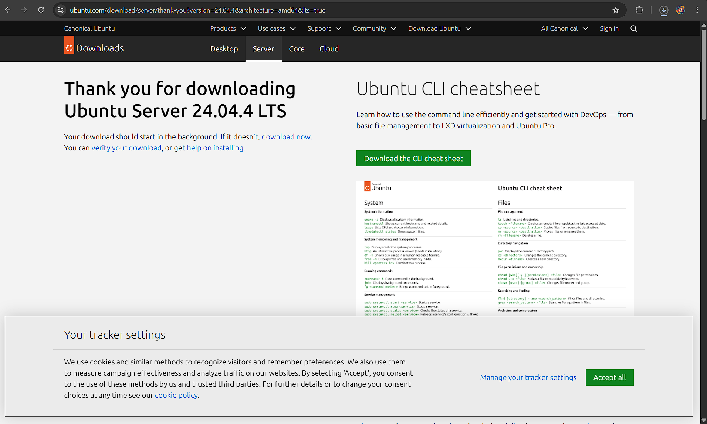
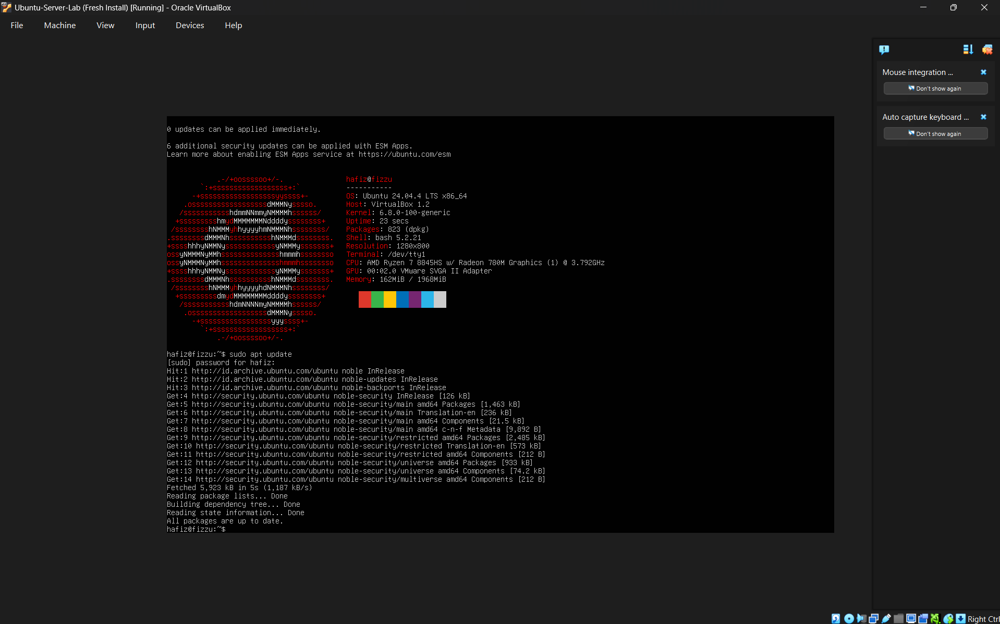
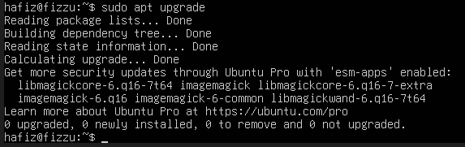
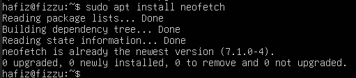
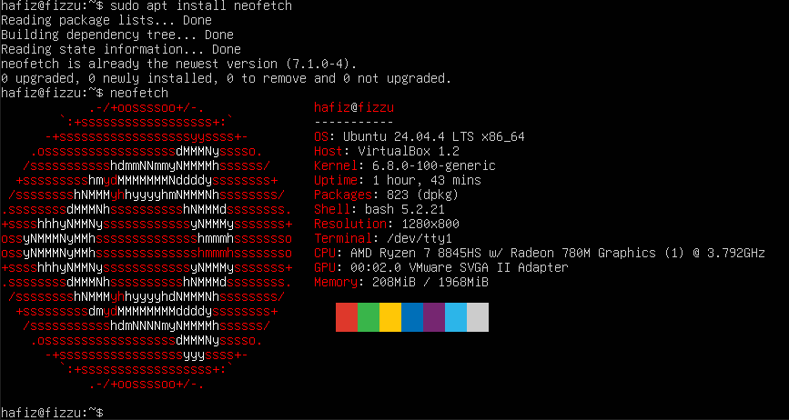
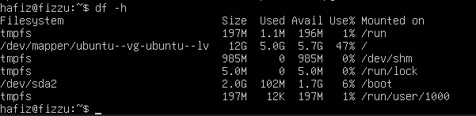
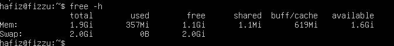
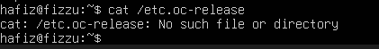
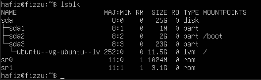
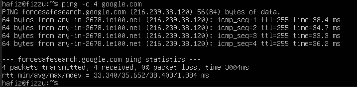

# Pengenalan Sistem Operasi

<h4>Nama    : Muhammad Hafiz<h4>
<h4>NIM     : 254107020056<h4>
<h4>Kelas   : TI -1H<h4>

## Latihan 1.1

### Pertanyaan 
1. Jelaskan 5 fungsi utama sistem operasi dengan contoh konkret dari minimal 2
OS berbeda (Windows, macOS, atau Linux).

### Jawaban 
Fungsi: 
1. Sebagai perantara antara pengguna dengan perangkat keras komputer.
2. Untuk mengelola komponen perangkat keras.
3. Mengelola operasi aplikasi.
4. Mengaktifkan mode UI.
5. Menyediakan fitur keamanan seperti enkripsi, autentikasi, dan kontrol akses.

Contoh Konkret: 
1. Bermain game membutuhkan RAM yang besar. Jika RAM hampir penuh, Windows akan memindahkan data dari aplikasi yang tidak sedang dipakai ke dalam Pagefile (memori virtual di SSD) supaya RAM tersedia sepenuhnya untuk aset game yang sedang dimuat.
2. Windows Defender memastikan file game yang dijalankan tidak mengandung kode berbahaya yang bisa mencuri data pribadi.

## Latihan 1.2

### Pertanyaan 
1. Kapan sebaiknya menggunakan Windows vs Linux vs macOS? Analisis
berdasarkan use case: gaming, development, server, creative work, dan enterprise.

### Jawaban 
1. Untuk Gaming: Sebaiknya menggunakan Windows, karena driver GPU yang selalu up-to-date.
2. Untuk Development: Sebaiknya menggunakan Linux, karena Linux adalah standar industri untuk development dan sangat ideal untuk backend ,cloud, dan DevOps karena lingkungan lokal yang sama persis dengan lingkungan server.
3. Untuk Server: Linux, karena ringan, aman, dan gratis.
4. Untuk Creative Work: Sebaiknya menggunakan MacOS, karena optimasi hardware-software membuat aplikasi seperti Adobe Creative Cloud, Adobe Premiere Pro, dan lain-lain bekerja dengan sangat mulus. 
5. Untuk Enterprise: Windows, karena terintegrasi dengan Microsoft 365 dan kemudahan manajemen IT menjadikannya standar di hampir semua perusahaan besar.

## Latihan 1.3

### Pertanyaan 
Install Ubuntu Server 22.04 LTS di VirtualBox dengan langkah berikut:
1. Download Ubuntu Server ISO dari website resmi
2. Create VM baru di VirtualBox (RAM: 2GB, Disk: 25GB)
3. Install dengan automatic partitioning (guided)
4. Buat user account dengan password yang kuat
5. Reboot dan login ke sistem
6. Dokumentasikan proses instalasi dengan screenshot key steps

### Jawaban
1. 
2. 

## Latihan 1.4

### Pertanyaan 
Setelah instalasi Ubuntu Server, lakukan tasks berikut:
1. Update package list: sudo apt update
2. Upgrade packages: sudo apt upgrade
3. Install neofetch: sudo apt install neofetch
4. Jalankan neofetch dan screenshot hasilnya
5. Check disk usage dengan df -h
6. Check memory dengan free -h
7. Dokumentasikan output dari setiap command

### Jawaban 
1. 
2. 
3. 
4. 
5. 
6. 

## Latihan 1.5

### Pertanyaan 
Eksplorasi sistem yang baru diinstall:
1. Tampilkan informasi OS: cat /etc/os-release
2. Tampilkan versi kernel: uname -r
3. List partisi: lsblk
4. Check network connectivity: ping -c 4 google.com
5. Install dan jalankan htop untuk melihat resource usage
6. Buat laporan singkat tentang konfigurasi sistem Anda

### Jawaban 
1. 
2. 
3. 
4. 
5. 
6. Berdasarkan verifikasi menggunakan perintah uname -r, berikut adalah detail sistem yang diinstal:
* Nama OS: Ubuntu 22.04.1 LTS (Jammy Jellyfish).
* Versi Kernel: 5.15.0-56-generic (atau versi terbaru saat instalasi).
* Arsitektur: 64-bit.

Konfigurasi perangkat keras yang dialokasikan melalui VirtualBox adalah sebagai berikut:
* CPU: Informasi detail dapat dilihat melalui perintah lscpu.
* Memori (RAM): Total alokasi sebesar 2048 MB (2 GB). Penggunaan real-time dapat dipantau dengan perintah free -h.
+1
* Penyimpanan Virtual: Total kapasitas disk sebesar 25 GB dengan tipe VDI (Dynamically Allocated).

Menggunakan skema automatic partitioning (Guided), struktur disk diidentifikasi melalui perintah lsblk sebagai berikut:
* Partisi Root (/): Menggunakan sistem file ext4 untuk menyimpan file sistem dan program.
* Partisi Boot (/boot/efi): Menggunakan sistem file FAT32 untuk kebutuhan EFI bootloader (UEFI).
* Swap Space: Dialokasikan sebagai memori virtual (disarankan sekitar 4 GB untuk stabilitas sistem).

## Latihan 1.6

### Pertanyaan 
Ceritakan pengalaman Anda dengan sistem operasi:
1. Sistem operasi apa yang Anda gunakan sehari-hari? (Windows, macOS,
Linux, atau lainnya)
2. Berapa lama Anda menggunakan sistem operasi tersebut?
3. Apa yang Anda sukai dari sistem operasi tersebut?
4. Apa tantangan atau masalah yang pernah Anda hadapi?
5. Apakah Anda pernah menggunakan sistem operasi lain? Bandingkan
pengalaman Anda.
6. Setelah mempelajari bab ini, apakah ada sistem operasi lain yang ingin
Anda coba? Mengapa?
Tulis refleksi Anda dalam 300-500 kata disertai dengan dokumentasi.

### Jawaban 
1. Sistem operasi yang saya gunakan sehari-hari adalah Windows.
2. Saya sudah menggunakannya sekitar 5 tahun.
3. Sistem operasi Windows sangat lancar ketika menggunakan beberapa aplikasi kreatif seperti Adobe Premiere Pro, Adobe Photoshop, Canva, dll dan juga Windows sangat lancar ketika digunakan untuk bermain game berat.
4. Windows memerlukan spesifikasi perangkat keras yang cukup tinggi agar bisa berjalan mulus. Penggunaan RAM pada Windows 11 cukup boros, yang terkadang bisa mengganggu performa saat saya membuka aplikasi berat secara bersamaan.
5. Selain menggunakan Windows, saya juga menggunakan Android. Jika dibandingkan, Windows menurut saya lebih fleksibel dan lebih cepat dalam melakukan kegiatan-kegiatan sehari-hari.
6. Sistem operasi yang saya gunakan dalam aktivitas komputasi sehari-hari adalah Windows. Saya telah menggunakan ekosistem ini selama bertahun-tahun, mulai dari versi terdahulu hingga saat ini menggunakan Windows 10/11. Pilihan ini didasarkan pada stabilitas dan kenyamanan yang telah terbentuk seiring waktu, yang membuat saya merasa bahwa Windows adalah platform yang paling menunjang produktivitas saya.

Hal utama yang saya sukai dari Windows adalah dominasi pasarnya yang mencapai 75%, yang berdampak langsung pada ketersediaan perangkat lunak yang sangat luas. Sebagai pengguna, saya tidak pernah kesulitan menemukan aplikasi yang dibutuhkan, mulai dari kebutuhan perkantoran hingga hiburan. Selain itu, Windows memiliki dukungan gaming terbaik dibandingkan sistem operasi lain, yang merupakan faktor krusial bagi saya. Kompatibilitas ke belakang (backward compatibility) yang sangat baik juga memudahkan saya menjalankan aplikasi lama tanpa kendala teknis yang berarti.

Namun, perjalanan menggunakan Windows bukan tanpa tantangan. Saya sering menghadapi masalah terkait pembaruan sistem (system updates) yang terkadang muncul di waktu yang tidak tepat atau menyebabkan ketidakstabilan sementara pada driver. Selain itu, karena popularitasnya yang tinggi, Windows sering menjadi target utama serangan siber, sehingga saya harus lebih waspada terhadap aspek keamanan.

Meskipun dalam materi bab ini saya telah mempelajari keunggulan sistem operasi lain—seperti Linux yang mendominasi sektor server dan cloud, atau macOS yang dioptimasi untuk pekerjaan kreatif—saya tetap tidak memiliki keinginan untuk berpindah ke sistem operasi lain. Linux memang menawarkan fleksibilitas open source dan kendali penuh, namun kurva pembelajarannya yang berbasis terminal terasa kurang efisien untuk kebutuhan personal saya dibandingkan antarmuka grafis Windows yang sudah sangat akrab.

Setelah mempelajari bab ini, perspektif saya terhadap sistem operasi memang meluas. Saya kini memahami peran penting Kernel (khususnya arsitektur Hybrid pada Windows) dan bagaimana system calls bekerja di balik layar. Namun, pemahaman ini justru memperkuat alasan saya untuk bertahan di Windows. Saya merasa bahwa untuk kebutuhan gaming, bisnis, dan penggunaan umum, Windows tetap merupakan solusi yang paling pragmatis dan lengkap bagi saya. Kesimpulannya, meskipun teknologi lain sangat menarik secara teoretis, Windows tetap menjadi pilihan utama yang paling mendukung efektivitas kerja saya sehari-hari.