# MANAJEMEN MEMORI DAN SYSTEM CALL
<h4>Nama    : Muhammad Hafiz<h4>
<h4>NIM     : 254107020056<h4>
<h4>Kelas   : TI -1H<h4>

## Praktikum 10.1 Melihat Penggunaan Memori
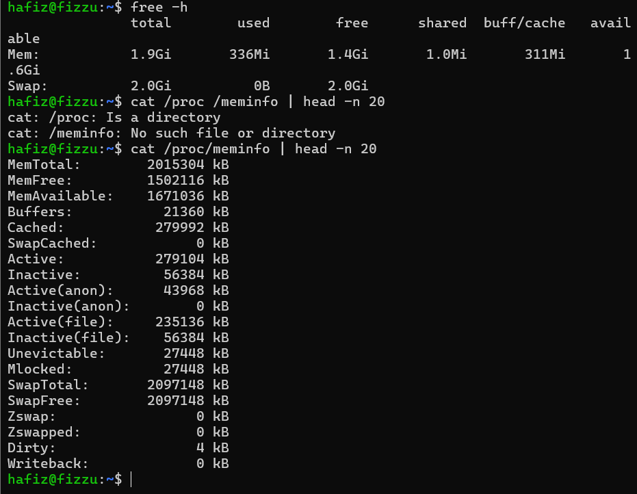

### Pertanyaan
1. Hitung persentase memori tersedia: available / total × 100%. Jika hasilnya
di bawah 10%, sistem mulai kekurangan memori.
2. Pada baris Swap, apakah kolom used bernilai 0? Jika lebih dari 0, kernel sudah
pernah memindahkan data ke disk karena RAM tidak cukup.
3. Perhatikan field Cached dan Buffers di /proc/meminfo. Nilai ini sesuai
dengan kolom buff/cache pada free -h.

### Jawaban
1. 1.6 / 1.9 × 100% = 84.2%
2. nilainya tercatat 0B (nol byte).
3. Jika dikonversi ke satuan MiB (dibagi 1024), hasilnya sekitar 294 MiB.

## Studi Kasuss 10.1 Server Lambat Karena Memori
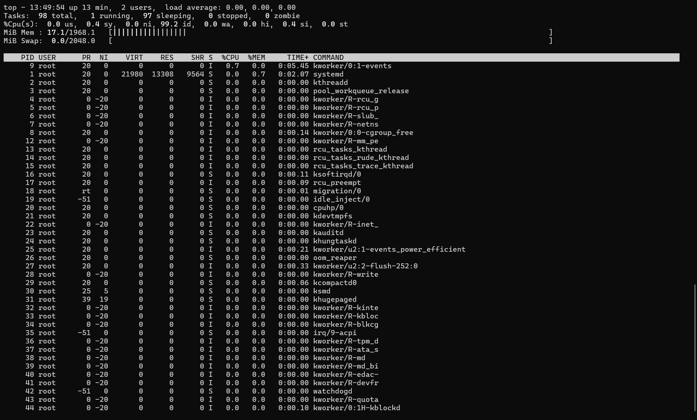

### Analisis:
1. Apakah nilai available sangat kecil (misalnya di bawah 200 MB pada server
dengan RAM 2 GB)? Jika ya, server kemungkinan kekurangan memori.
2. Apakah kolom used pada baris Swap lebih dari 0? Jika ya, kernel sedang
menggunakan swap, yang berarti performa menurun.
3. Di tampilan top, proses apa yang memiliki %MEM terbesar? Proses tersebut
menjadi kandidat utama penyebab lambatnya server.

### Jawaban
1. Tidak, nilai available memori masih jauh di atas 200MB.
2. Karena swap di server tidak tersentuh, performanya saat ini sangat optimal.
3. systemd (PID 1) dengan nilai %MEM sebesar 0.7%.

## Praktikum 10.2 Mengamati Aktivitas Paging
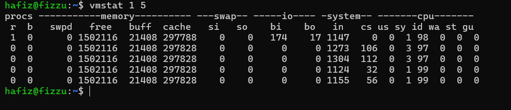

## Analisis:
1. Amati nilai si dan so pada kelima baris. Pada sistem normal dengan RAM cukup, kedua nilai ini selalu 0.
2. Jika nilai si atau so sesekali muncul lebih dari 0, artinya pernah ada aktivitas swap. Ini masih wajar jika tidak terus-menerus.
3. Jika si dan so terus-menerus lebih dari 0, sistem dalam kondisi memory pressure serius — performa turun drastis karena akses disk jauh lebih lambat dari RAM.
4. Perhatikan juga kolom free (RAM kosong) dan buff (buffer) untuk memahami kondisi keseluruhan RAM saat itu.

### Jawaban
1. Nilainya selalu 0 di kelima baris pengujian. Sistem berjalan sangat normal.
2. Angkanya stabil di 1502116. Kolom buff juga tetap di angka 21408.

## Praktikum 10.3 Membuat dan Mengonfigurasi Swap File
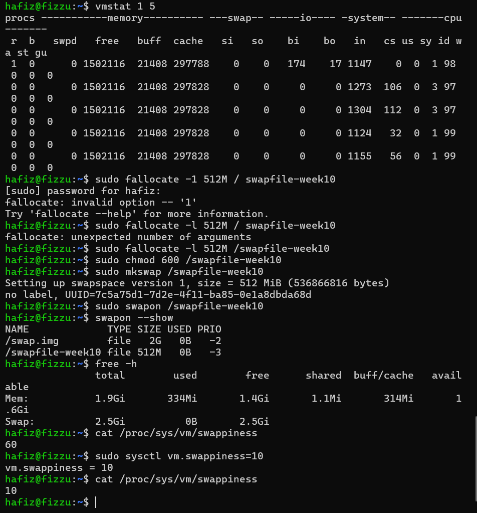

### Analisis:
1. Berapa nilai swappiness default? Apa artinya bagi perilaku kernel dalam menggunakan swap?
2. Setelah diubah ke 10, konfirmasi nilai berubah pada output cat kedua. Apa dampak nilai 10 terhadap penggunaan swap dibanding nilai 60?
3. Apakah entri /swapfile-week10 muncul di swapon –show? Jika tidak,
pastikan Langkah 2 (chmod 600) sudah dijalankan sebelum Langkah 3.

### Jawaban
1. Nilai swappiness default adalah 60. Nilai 60 adalah nilai standar pada kebanyakan distribusi seperti ubuntu. Ini berarti kernel memiliki kecenderungan yang seimbang. Kernel akan mulai memindahkan sebagian data aplikasi yang jarang dipakai RAM ke swap meskipun RAM belum benar-benar 100% penuh. Tujuannya adalah untuk menyiksa ruang RAM fisik agar bisa digunakan sebagai cache
2. Menurunkan nilai swap menjadi 10 artinya kernel akan berusaha sekuat tenaga menahan semua data proses/aplikasi tetap berada di RAM fisik yang cepat. Kernel lebih memilih untuk membuang cache file daripada memindahkan data ke swap
3. Berhasil muncul dengan ukuran 512M.

## Praktikum 10.4 Monitoring Memory
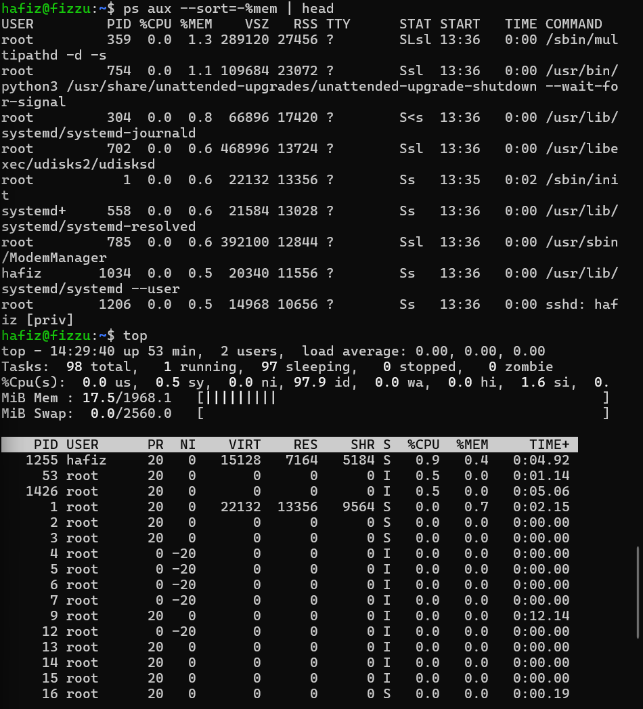

### Pertanyaan
1. Proses apa yang berada di urutan pertama? Catat nilai %MEM dan RSS-nya.
2. Konversikan RSS dari KB ke MB (bagi 1024). Misalnya, RSS=524288 berarti proses menggunakan 512 MB RAM. Apakah wajar untuk jenis program tersebut?
3. Mengapa VSZ selalu lebih besar dari RSS pada proses yang sama?
4. Apakah urutan proses di ps konsisten dengan tampilan top saat diurutkan berdasarkan %MEM?

### Jawaban
1. proses /sbin/multipathd -d -s
2. 27456KB : 1024 = 26,8. Apakah wajar? Iya, multipathd adalah program daemon bawaan linux yang bertugas mengelola jalur ke perangkat penyimpanan.
3. Ini karena perbedaan mendasar pada memori virtual dan memori fisik.
4. Urutannya tidak konsisten.

## Praktikum 10.5 Script Monitor Memori

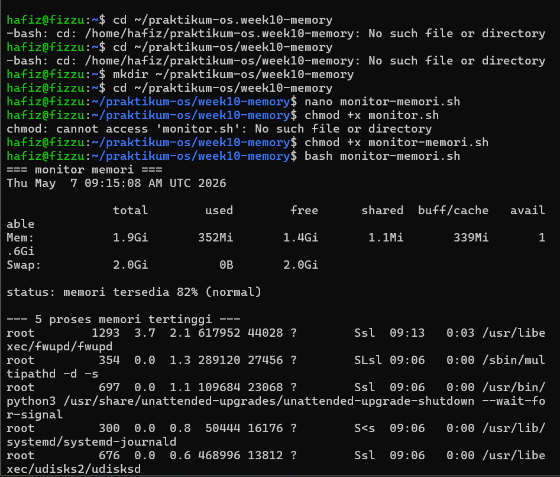

### Analisis
1. Variabel THRESHOLD=20 menetapkan batas persentase. Perintah free | awk
’/Mem/ {printf "%d", $7/$2*100}’ mengambil kolom ke-7 (available) dibagi kolom ke-2 (total) dari baris Mem, lalu dikalikan 100 untuk menghasilkan
persentase bilangan bulat.
2. Kondisi if [ "$AVAIL" -lt "$THRESHOLD" ] bernilai benar jika persentase memori tersedia di bawah 20.
3. Ubah THRESHOLD menjadi 90 dan jalankan ulang. Apa yang berubah pada output? Mengapa demikian?

### Jawaban
1. Pesan status pad output akan berubah dari yamg sebelumnya menampilkan kondisi normal menjadi pesan peringatan.
2. Jika mengubah variabel THRESHOLD menjadi 90, maka evaluasi kondisinya menjadi if [82 -lt 90]. Karena pernyataan tersebut bernilai True, maka script akan mengeksekusi baris kode yang berada di dalam blok if dan mengabaikan blok else.

## Studi Kasus 10.2 Gagal Akses File

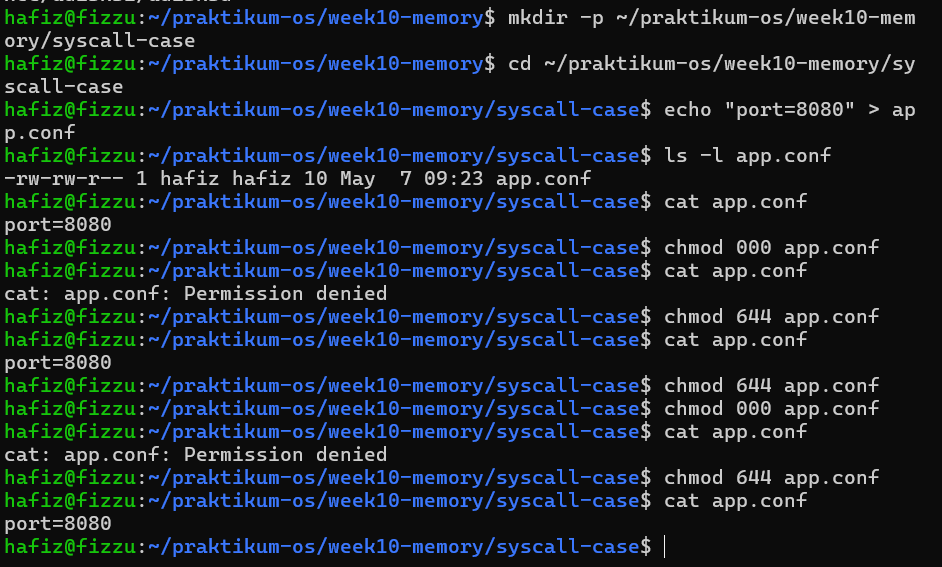

### Analisis:
1. Mengapa cat menghasilkan Permission denied setelah chmod 000? System call apa yang gagal?
2. Apa perbedaan pesan error Permission denied vs No such file or directory? Coba rm app.conf lalu cat app.conf untuk melihat perbedaannya.
3. Permission 644 berarti apa untuk owner, group, dan others?

### Jawaban
1. Perintah chmod 000 mencabut seluruh hak akses (baca, tulis, dan eksekusi) pada file tersebut untuk semua entitas (pemilik, grup, dan pengguna lain). Ketika Anda menjalankan cat, program tersebut meminta izin ke sistem operasi untuk membaca isi file, namun diblokir oleh kernel karena izinnya kosong.
2. Permission denied: Filenya secara fisik ada di dalam direktori tersebut, tetapi sistem operasi melarang mengaksesnya karena pembatasan hak akses. No Such File or Directory: Filenya tidak ada.
3. Angka 6: Memiliki hak read + write.
Angka 4: Hak read saja.
Angka 4: Memiliki hak read saja.

### Praktikum 10.6 Mengamati System Call dengan Strace
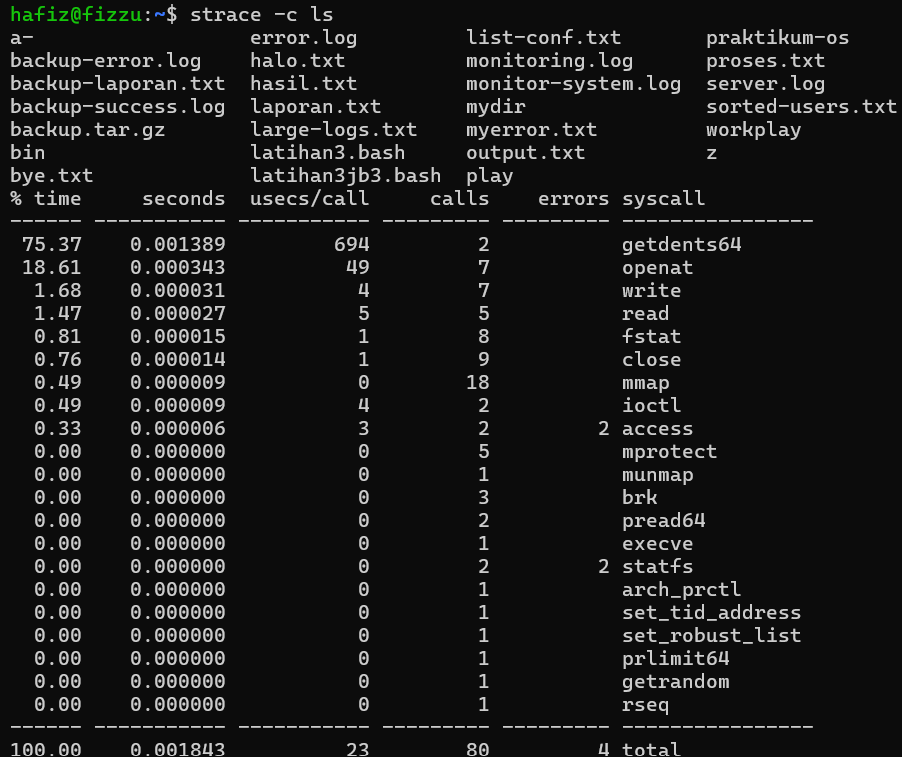
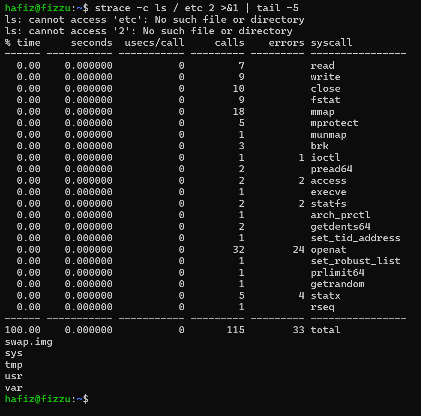
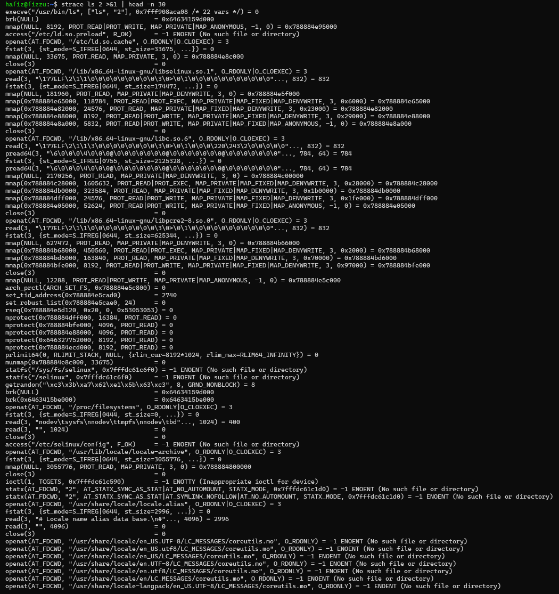

### Analisis:
1. Dari output Langkah 1, identifikasi minimal 4 system call berbeda. Jelaskan fungsi singkat masing-masing berdasarkan argumen yang terlihat.
2. Dari ringkasan strace -c, system call mana yang paling sering dipanggil?
Mengapa?
3. Apakah ada system call dengan errors lebih dari 0? Apakah itu berarti program bermasalah, ataukah bagian normal dari logika program?
4. Apakah jumlah system call berbeda antara ls dan ls /etc? Faktor apa yang menyebabkan perbedaan tersebut?

### Jawaban
1. - execve: System call ini digunakan untuk emulai eksekusi sebuah program.
- openat: Digunakan untuk membuka sebuah file atau direktori. Pada argumennya, terlihat path file yang diminta dan flag aksesnya, seperti O_RDONLY yang menandakan file hanya untuk dibaca.
- read: Berfungsi untuk membaca isi data dari sebuah file yang sudah dibuka. Argumen 3 merujuk pada file descriptor sumber data dibaca.
- close: Berfungsi untuk menutup akses ke sebuah file descriptor ketika program sudah selesai menggunakannya untuk membebaskan sumber daya.
2. System call yang paling sering dipanggil adalah mmap dengan total 18 kali pemanggilan. Program dasar linux seperti ls bergantung pada beberapa shared library agar bisa berjalan.
3. Ada dua system call yang mencatatkan error lebih dari 0, yaitu access dan statfs. System call yang error lebih dari 0 belum tentu bermasalah, dalam kasus perintah dasar seperti ls, adanya sejumlah kecil error pada system call tertentu biasanya adalah bagian normal dari logika program.
4. Jumlah system call antara eksekusi perintah ls dan ls /etc akan berbeda. ls /etc akan menghasilkan jumlah system call yang jauh lebih banyak. Salah satu faktor yang menyebabkannya adalah jumlah file dan subdirektori. Perintah ls /etc menargetkan direktori /etc, yaitu pusat konfigurasi sistem linux yang secara bawaan berisi ratusan file dan subdirektori. 

## Tugas 10.1 Audit Penggunaan Memori Sistem
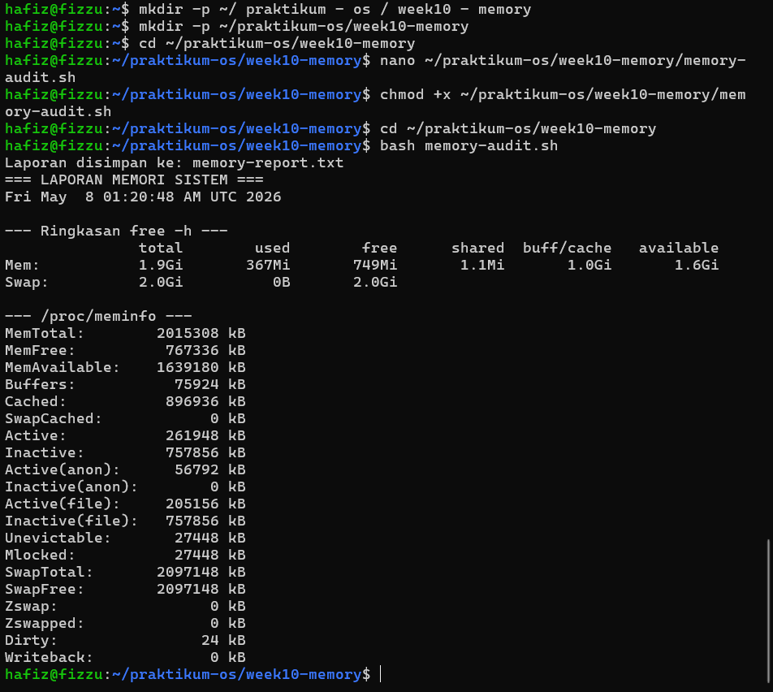

### Analisis
1. Hitung persentase memori tersedia (available / total × 100%). Apakah sistem dalam kondisi normal?
2. Mengapa buff/cache tidak dihitung sebagai memori yang terpakai dari sudut pandang ketersediaan untuk aplikasi?
3. Dari /proc/meminfo, apakah SwapTotal lebih besar dari 0? Berapa nilai SwapFree?

### Jawaban
1. 1.639.180/2.105.308*100% = 81.3%. Sistem dalam kondisi normal dan sangat sehat.
2. Buff/cache adalah memori yang sedang dipinjam sementara oleh kernel linux untuk menyimpan data cache dari disk/
3. Swap tertulis lebih besar dari 0, tertulis 2097148kB. Nilai SwapFree juga sama.

## Tugas 10.2 Identifikasi Proses dengan Memori Tertinggi
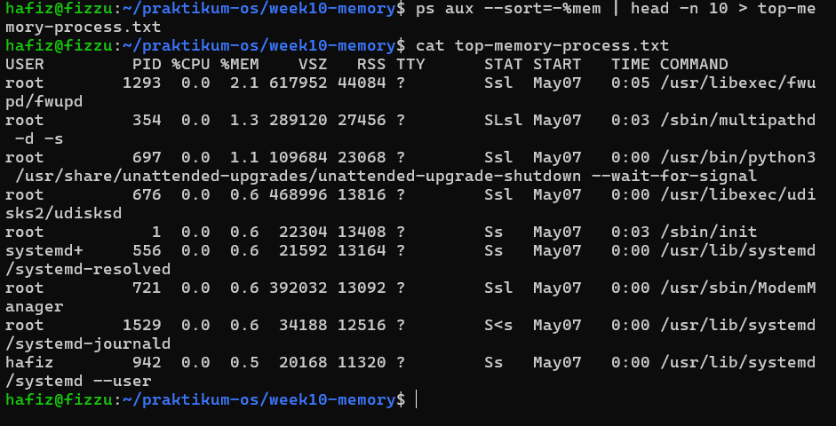

### Analisis
1. Proses apa di urutan pertama? Catat nilai %MEM dan RSS.
2. Konversikan RSS ke MB (bagi 1024). Apakah wajar?
3. Jumlahkan %MEM dari 5 proses teratas. Berapa persen RAM yang mereka gunakan bersama?

### Jawaban
1. Nama proses: /usr/libexec/fwupd/fwupd.
Nilai %MEM: 2.1
Nilai RSS: 44084
2. Konversi: 44.084 KB / 1024 = 43,05 MB.
3. Nilai 5 proses teratas: 2.1 + 1.3 + 1.1 + 0.6 + 0.6
Total Keterpakaian: 5,7%

## Tugas 10.3 Membuat dan Memverifikasi Swap File
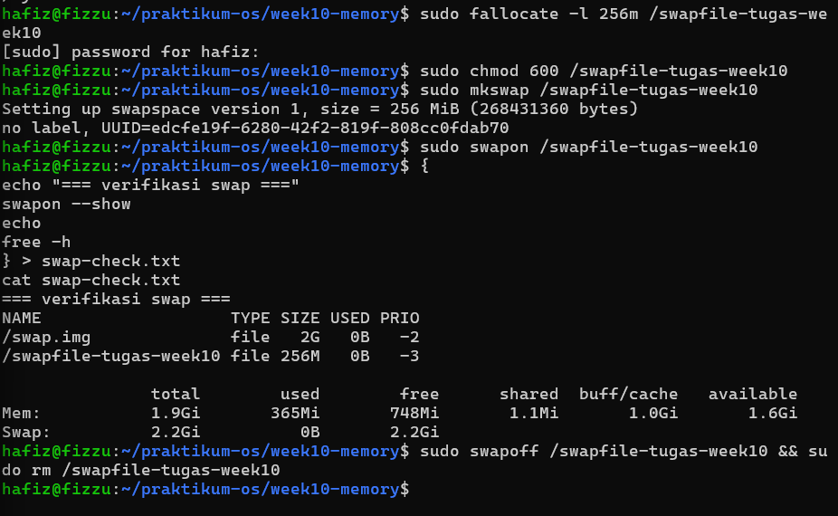

### Analisis
1. Identifikasi kolom NAME, TYPE, SIZE, dan USED pada output swapon –show.
2. Apakah nilai total pada baris Swap di free -h bertambah 256 MB?
3. Mengapa permission 600 penting? Apa risiko jika diatur ke 644?

### Jawaban
1. 
- Swap Utama (Bawaan Sistem):
NAME: /swap.img
TYPE: file
SIZE: 2G
USED: 0B
- NAME: /swapfile-tugas-week10
TYPE: file
SIZE: 256M
USED: 0B
2. Nilai total pada baris Swap sekarang terbaca 2.2Gi.
3. Pentingnya 600 adalah izin ini secara ketat membatasi akses sehingga hanya akun administrator yang bisa membaca atau menulis swap file tersebut. Risiko jika 644 adalah sangat berbahaya karena memberikan hak baca kepada semua pengguna di dalam sistem.

## Tugas 10.4 Analisis System Call dengan Strace
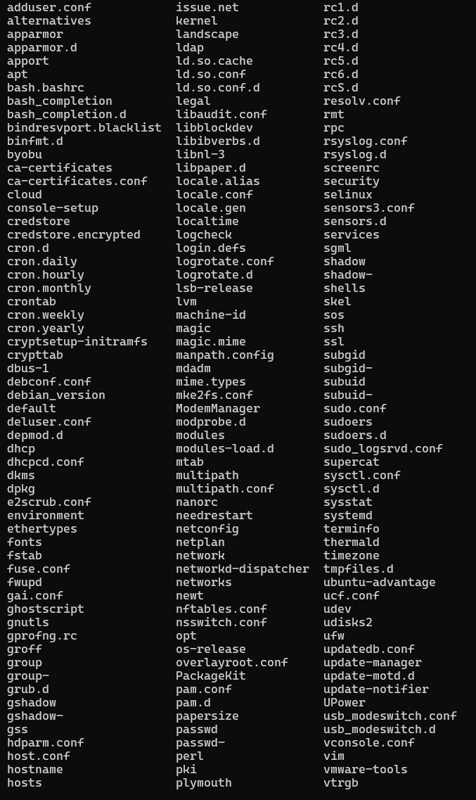
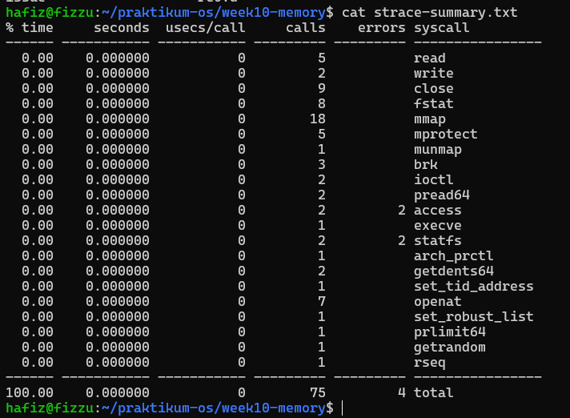

### Analisis
1. Sebutkan minimal 5 system call dari strace-summary.txt beserta fungsi singkatnya.
2. System call mana yang paling sering dipanggil? Mengapa?
3. Apakah ada errors lebih dari 0? Apakah program tetap berjalan normal meskipun ada kegagalan tersebut?

### Jawaban
- mmap: Digunakan untuk memetakan file atau device ke dalam memori virtual. Biasanya dipakai saat program dimuat (startup) untuk memasukkan shared libraries ke memori.
- openat: Digunakan untuk membuka sebuah file atau direktori yang letaknya relatif terhadap suatu directory file descriptor.
- close: Bertugas untuk menutup file descriptor yang sudah tidak dipakai, membebaskan sumber daya kernel.
- fstat: Mengambil informasi status/metadata dari sebuah file (seperti ukuran atau hak akses) yang sedang terbuka (menggunakan file descriptor).
- read: Membaca serangkaian byte data dari sebuah file descriptor yang sudah terbuka.
2. System call yang paling banyak dipanggil adalah mmap (sebanyak 18 kali). Program ls membutuhkan beberapa shared libraries (seperti libc untuk fungsi-fungsi C, atau library terkait lokalisasi bahasa) agar bisa berfungsi.
3. Pada kolom errors, terdapat 2 jenis system call yang mengalami kegagalan, yaitu access (2 errors) dan statfs (2 errors). Program tetap berjalan sepenuhnya dengan normal. Error pada tingkat system call ini sering terjadi secara natural saat sebuah program sedang "meraba" lingkungannya. 

## Tugas 10.5 Studi Kasus Diagnosa Server Lambat
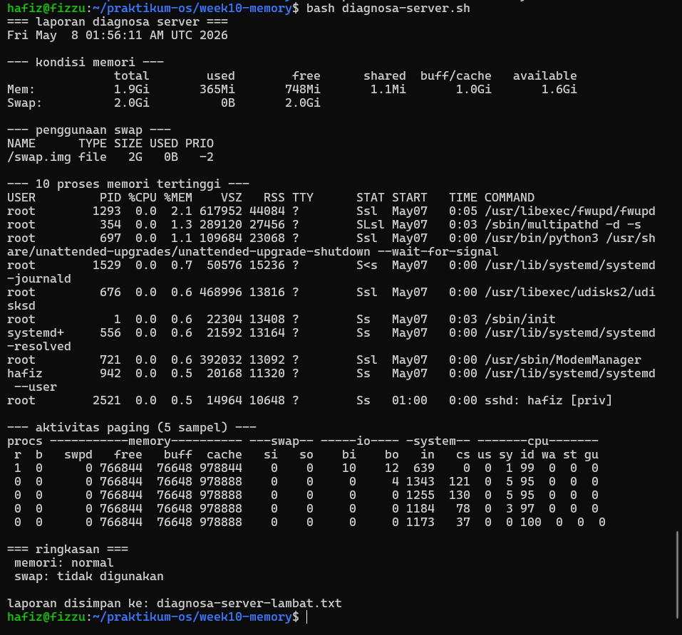

### Analisis
1. Jelaskan peran masing-masing fungsi: cek_memori, cek_swap,  cek_proses, cek_paging, dan ringkasan. Mengapa diagnosa dipecah menjadi fungsi
terpisah?
2. Berdasarkan bagian RINGKASAN, apakah kondisi sistem normal atau kritis?
Jelaskan berdasarkan nilai threshold yang digunakan script.
3. Mengapa script menggunakan tee "$LAPORAN" bukan redirection biasa > "$LAPORAN"? Apa keuntungannya?
4. Dari output cek_paging, apakah ada aktivitas si atau so? Jika ada, apa implikasinya terhadap performa server?

### Jawaban
1. Peran Masing-Masing Fungsi dan Tujuan Pemecahan
cek_memori: Mengevaluasi persentase kapasitas RAM yang tersedia (available) terhadap total RAM menggunakan free dan awk, lalu memberikan peringatan jika nilainya di bawah ambang batas (threshold).  
cek_swap: Memeriksa keberadaan area swap yang aktif melalui swapon --show dan mendeteksi apakah swap tersebut sedang terpakai dengan membaca keluaran free.  
cek_proses: Mengurutkan dan menampilkan 10 proses yang paling banyak mengonsumsi memori (menggunakan ps aux --sort=-%mem) untuk mengidentifikasi penyebab beban RAM.  
cek_paging: Memantau perpindahan data secara real-time antara RAM dan disk (swap) dengan menggunakan vmstat 1 5.
2. Kondisi: Sistem dalam kondisi normal. Penjelasan Threshold: Script Anda menetapkan threshold pada angka 20%. Artinya, sistem baru akan dianggap kritis jika memori yang tersedia (available) berada di bawah 20% dari total RAM.
3. Redirection standar (>) hanya akan menulis keluaran program ke dalam sebuah file (dalam hal ini $LAPORAN) secara diam-diam, sehingga layar terminal akan kosong. 
Perintah tee "$LAPORAN" berfungsi layaknya pipa bercabang: ia mengarahkan output program ke dalam file sekaligus menampilkannya ke layar terminal (Standard Output) secara bersamaan.
4. Aktivitas si / so: Berdasarkan hasil vmstat pada bagian --- aktivitas paging (5 sampel) ---, nilai pada kolom si (swap in) dan so (swap out) semuanya adalah 0. Tidak ada aktivitas paging sama sekali.
Implikasi: Ini adalah kondisi yang sangat ideal.