# Manajemen File & User/Group
<h4>Nama    : Muhammad Hafiz<h4>
<h4>NIM     : 254107020056<h4>
<h4>Kelas   : TI-1H<h4>

## Praktikum 9.1
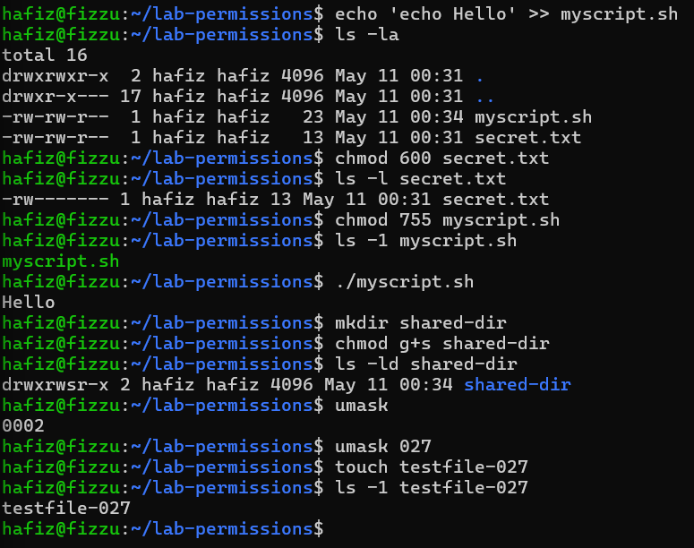

### Analisis
1. Mengapa secret.txt tidak dapat dibaca oleh group dan others setelah chmod 600?
2. Apa perbedaan arti 600 dan 755 terhadap file yang diuji?
3. Setelah umask 027, permission apa yang dihasilkan untuk file baru, dan mengapa bukan 777?

### jawaban
1. Perintah chmod 600 menerapkan sistem notasi oktal absolut pada file tersebut. Dalam sistem ini, tiga angka mewakili identitas akses secara berurutan: owner, group, dan others.
2. Perbedaannya terletak pada seberapa terbuka file tersebut bagi pengguna lain dan apakah file tersebut bisa dieksekusi sebagai program.
3. Setelah menerapkan umask 027, permission yang dihasilkan untuk file reguler baru adalah 640 (secara simbolik rw-r-----).

### Tantangan
Ubah owner atau group salah satu file uji ke akun atau group lain yang tersedia di sistem, kemudian jelaskan
perubahan output ls -l sebelum dan sesudahnya.

### Jawaban
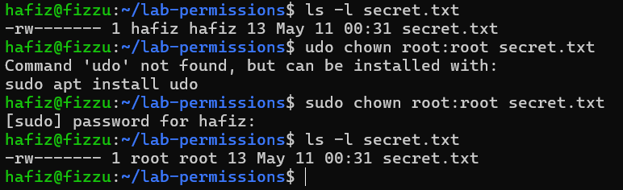
Karena permission file tersebut masih 600 (hanya owner yang punya hak akses)  dan ownernya kini sudah berubah menjadi root, maka User tidak akan bisa lagi membaca isi file tersebut menggunakan perintah normal seperti cat secret.txt. Sistem akan menolak akses User (Permission denied). User baru bisa membacanya jika menggunakan sudo cat secret.txt.

## Praktikum 9.2 ACL
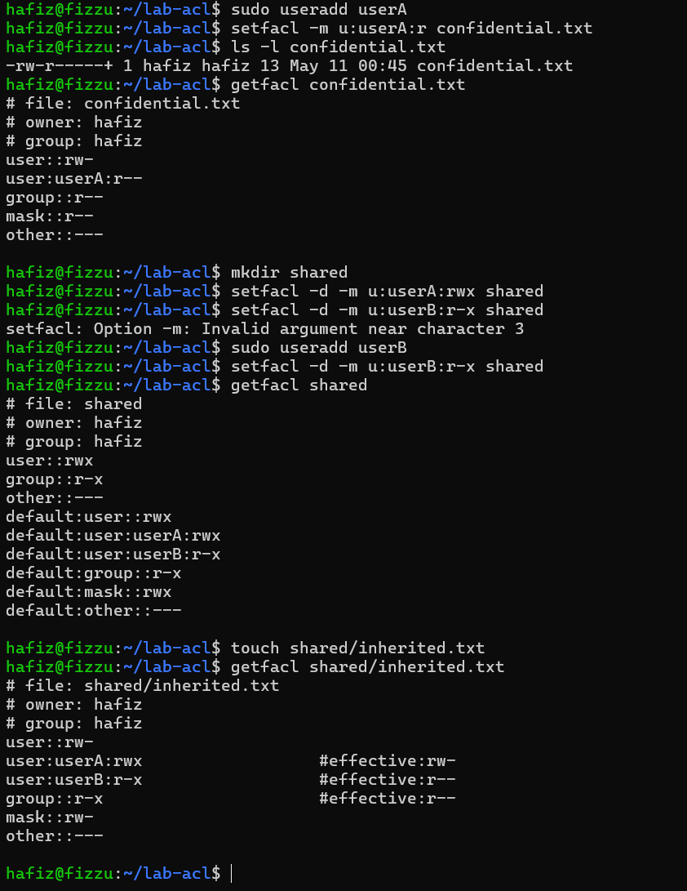

### Analisis
1. Mengapa getfacl confidential.txt awalnya tidak menampilkan user tertentu?
2. Setelah setfacl -m u:userA:r confidential.txt, apa perbedaan output ls -l dan getfacl?
3. Mengapa file inherited.txt mewarisi ACL dari direktori shared?

### Jawaban
1. Jika sebuah file belum memiliki ACL tambahan, perintah getfacl hanya akan membaca dan menampilkan tiga entri dasar yang sepadan dengan permission Unix standar, yaitu hak untuk owner, group, dan others.
2. Perintah setfacl tersebut menambahkan aturan akses baru khusus untuk userA, yang menghasilkan dua perubahan mencolok pada output: 
- Pada ls -l: Akan muncul tanda plus (+) di akhir string permission file tersebut. Tanda ini adalah indikator dari Linux yang memberitahu bahwa file tersebut memiliki aturan ACL tambahan yang aktif.
- ada getfacl: Output kini menjadi lebih detail dan menampilkan baris entri tambahan, yaitu user:userA:r--. Entri ini membuktikan bahwa userA telah berhasil diberikan hak baca (read) secara spesifik tanpa mengubah owner atau group utama file tersebut.
3. File tersebut secara otomatis mewarisi ACL karena direktori induknya (shared) telah dikonfigurasi menggunakan fitur Default ACL. Pada perintah pembuatan direktori, terdapat penggunaan opsi -d (misalnya pada setfacl -d -m u:userA:rwx shared), yang berfungsi untuk menetapkan default ACL.

### Tantangan
Tambahkan satu ACL lagi agar group readonly-group hanya dapat membaca confidential.txt. Setelah
itu, hapus ACL untuk userA dan verifikasi hasil akhirnya dengan getfacl.

### Jawaban 
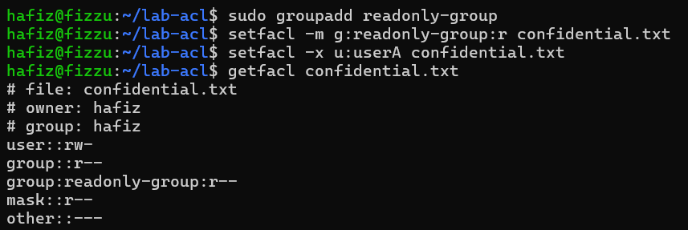

## Praktikum 9.3A Membuat dan Mengelola User

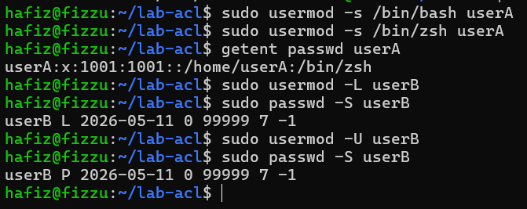

### Pertanyaan:
1. Apa perbedaan output id userA sebelum dan sesudah menambah group?
2. Bagaimana status passwd -S userB berubah saat akun di-lock?

### Jawaban
1. Perintah id yang dijalankan pada terminal berfungsi untuk merangkum dan menampilkan identitas autentikasi seorang pengguna secara utuh. Sebelum pengguna ditambahkan ke dalam kelompok atau group tambahan, teks keluaran dari perintah ini hanya akan memperlihatkan identitas dasarnya saja, yakni user ID beserta primary group ID yang secara baku dibuat otomatis dengan nama yang sama dengan pengguna tersebut. Begitu Anda menambahkan pengguna tersebut ke kelompok lain menggunakan perintah modifikasi, bagian informasi group pada teks keluaran akan bertambah panjang karena sistem kini mencantumkan daftar nama beserta ID dari seluruh kelompok baru yang menaungi pengguna bersangkutan.
2. Status yang ditampilkan oleh perintah passwd -S akan berubah secara spesifik pada bagian indikatornya. Saat akun berada dalam kondisi normal, sistem menunjukkan status aktif yang memungkinkannya untuk login. Namun, setelah dilakukan penguncian, indikator tersebut secara langsung akan berubah menjadi "L" yang merepresentasikan bahwa akun tersebut berada dalam kondisi "Locked" dan akses loginnya telah diblokir.

## Praktikum 9.3B Group Management
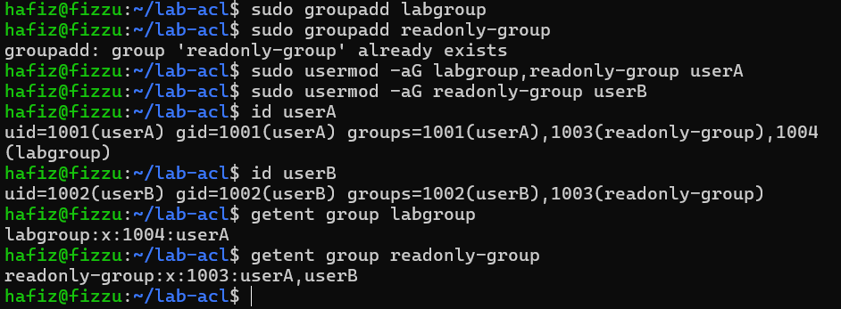

### Pertanyaan:
1. Apa yang ditampilkan id userA vs groups userA?
2. Mengapa -a pada usermod -aG penting?

### Jawaban
1. Perintah id userA menampilkan informasi identitas pengguna yang lebih lengkap dan akurat karena memperlihatkan User ID (UID), Group ID (GID) utama, serta daftar semua group tambahan beserta ID numeriknya secara berurutan. Sebaliknya, perintah groups userA berfokus pada kesederhanaan dengan hanya mencetak teks berupa daftar nama-nama kelompok yang menaungi pengguna tersebut tanpa menyertakan informasi ID numeriknya.
2. Penggunaan opsi -a (append) sangat krusial karena berfungsi untuk menambahkan pengguna ke dalam group baru tanpa menghapus keanggotaan dari group yang sudah ada.

## Praktikum 9.3C Password Aging Policy
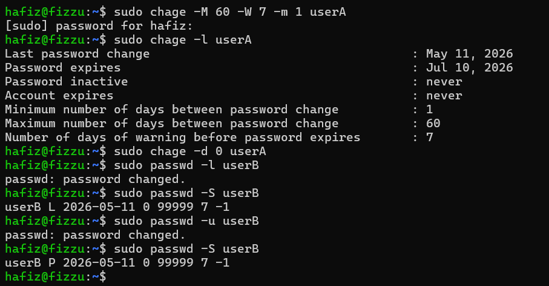

### Pertanyaan:
1. Apa arti nilai yang ditampilkan chage -l userA?
2. Bagaimana cara membuktikan userB terkunci dari output passwd -S?
3. Kapan sebaiknya menggunakan chage -d 0 vs passwd -e?

### Jawaban
1. Nilai yang dimunculkan oleh perintah tersebut merepresentasikan status kebijakan umur kata sandi atau password aging dari pengguna yang bersangkutan.
2.  Mengonfirmasi status penguncian tersebut dengan memeriksa langsung indikator pada teks keluaran yang dihasilkan.
3. Kedua sintaks tersebut secara fungsional memiliki tujuan akhir yang sama persis, yakni memaksa pengguna untuk segera melakukan pergantian kata sandi pada saat mereka masuk ke sistem untuk pertama kalinya.

### Tantangan
Buat user bernama intern yang:
- memiliki shell /bin/bash;
- menjadi anggota labgroup;
- dipaksa ganti password pada login pertama;
- password expired setelah 45 hari dengan warning 7 hari sebelumnya.

### Jawaban
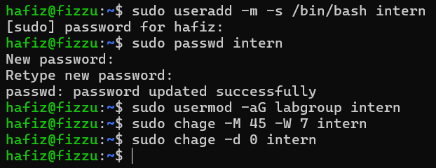

## Praktikum 9.4 Konfigurasi sudo
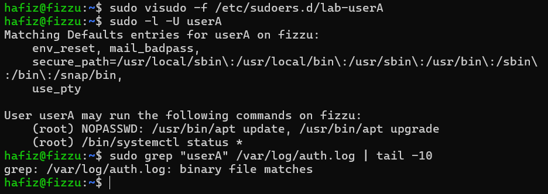

Analisis
1. Mengapa aturan disimpan di /etc/sudoers.d//, bukan langsung di /etc/sudoers?
2. Mana perintah yang bisa dijalankan tanpa password, dan mana yang masih perlu autentikasi?
3. Informasi apa saja yang dicatat di log sudo?

### Jawaban
1. Pendekatan ini jauh lebih aman dan tertata karena memisahkan aturan khusus dari file konfigurasi utama, sehingga meminimalisasi risiko kesalahan sintaks fatal yang berpotensi mengunci akses administratif Anda ke dalam sistem.
2. Berdasarkan aturan yang dimasukkan, pengguna diberikan hak khusus untuk mengeksekusi perintah /usr/bin/apt update dan /usr/bin/apt upgrade secara langsung tanpa perlu memasukkan kata sandi.
3. Pencatatan pada file log sistem berfungsi sebagai instrumen audit untuk memastikan bahwa seluruh pemakaian hak administratif benar-benar terekam.

### Tantangan
Tambahkan satu aturan baru agar userA boleh menjalankan /bin/systemctl restart ssh tetapi tidak boleh
menjalankan reboot.

### Jawaban
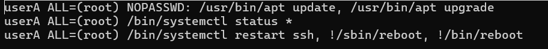

## Praktikum 9.5 Disk Quota
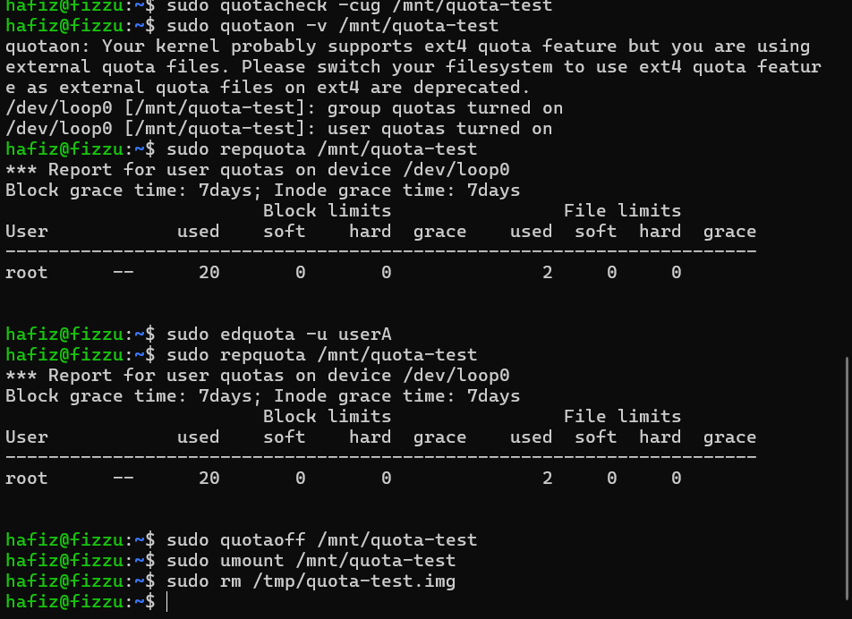

### Analisis
1. Apa perbedaan soft limit dan hard limit saat quota mulai terlampaui?
2. Mengapa praktikum ini memakai loopback filesystem, bukan langsung /home/?
3. Dari output repquota, informasi apa yang menunjukkan quota sudah aktif?

### Jawaban
1. Perbedaan utamanya terletak pada toleransi yang diberikan oleh sistem. Soft limit masih mengizinkan pengguna untuk terus menyimpan data dan melampaui batas kapasitas secara sementara selama masa tenggang atau grace period belum berakhir.
2. Metode ini memungkinkan User untuk melakukan uji coba konfigurasi secara leluasa tanpa perlu mengambil risiko memodifikasi atau merusak sistem file utama seperti direktori /home/ yang sedang berjalan.
3. Informasi utama yang menunjukkan bahwa penegakan kuota telah berjalan dapat dilihat pada laporan ringkas yang ditampilkan oleh utilitas tersebut.

### Tantangan
Coba atur quota baru untuk userA dengan batas inode yang sangat kecil, kemudian jelaskan kapan pembatasan
inode lebih penting daripada pembatasan block.

### Jawaban
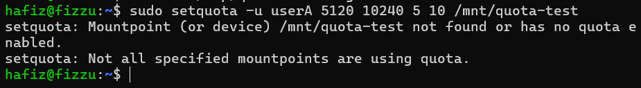

## Latihan 9.A Audit dan Kolaborasi

### Pertanyaan
1. Temukan file SUID aktif dengan find / -perm -4000 -type f 2>/dev/null, lalu jelaskan
tiga file yang Anda kenali beserta alasannya.
2. Cari direktori world-writable dan tentukan mana yang valid dan mana yang berisiko.
3. Rancang konfigurasi permission standar dan ACL untuk direktori proyek /srv/webapp/ agar
group webapp-team dapat menulis, user deploy hanya membaca, dan file baru selalu mewarisi
group proyek.

### Jawaban
1. 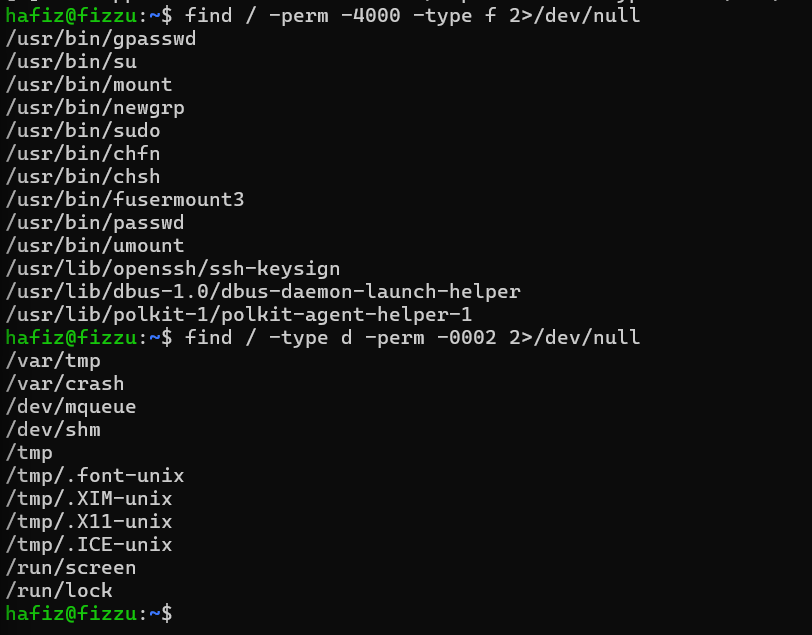

## Latihan 9.B Kebijakan Akun dan Quota

### Pertanyaan
Tuliskan langkah untuk membuat user intern, menambahkannya ke group labgroup, memaksa pergantian password tiap 45 hari (warning 7 hari), memberi izin sudo hanya untuk systemctl status, dan
menetapkan quota ruang serta inode sederhana pada /home/.

### Jawaban
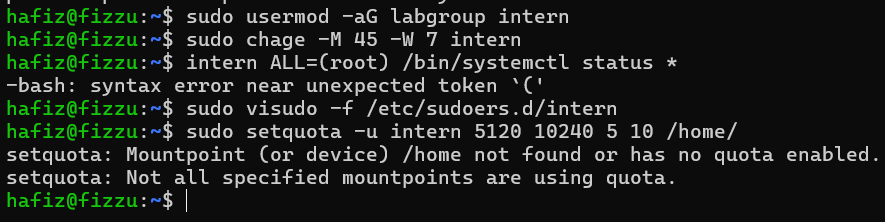