# Manajemen File & User/Group
<h4>Nama    : Muhammad Hafiz<h4>
<h4>NIM     : 254107020056<h4>
<h4>Kelas   : TI-1H<h4>

## Praktek 10.1 Amati Layanan Aktif Saat Boot

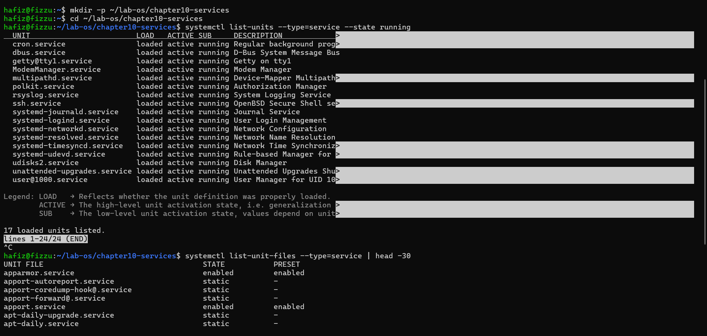

### Tantangan
Identifikasi tiga layanan dengan waktu inisialisasi terlama menggunakan systemd-analyze blame. Gunakan pipeline dari Bab 3 (| sort -rh | head -3) untuk mempercepat pencariannya. Untuk setiap layanan, cari tahu fungsinya dengan systemctl cat nama-layanan. Tuliskan nama layanan, waktu inisialisasinya, dan penjelasan singkat fungsinya. 

### Jawaban
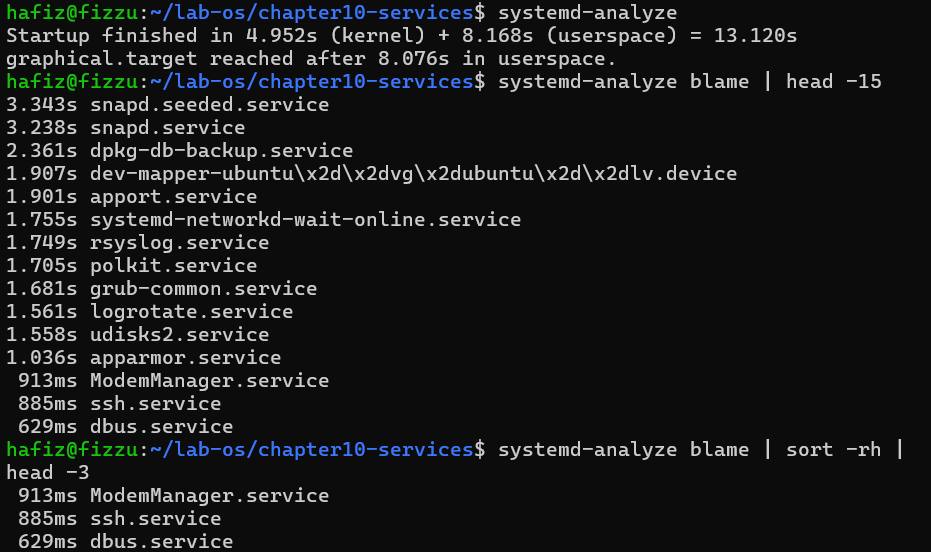

- Waktu Inisialisasi: 3.343s
Fungsi Singkat: Layanan ini bertugas untuk memuat dan memastikan paket-paket snap bawaan (seeded) sudah terpasang dan siap digunakan saat sistem booting.
- Waktu Inisialisasi: 3.238s Fungsi Singkat: Ini adalah daemon utama (layanan latar belakang) yang mengelola instalasi, pembaruan, dan penghapusan aplikasi berformat Snap di Ubuntu.
- Waktu Inisialisasi: 2.361s Fungsi Singkat: Layanan ini berfungsi untuk melakukan backup (pencadangan) basis data dpkg (sistem manajemen paket Debian/Ubuntu) secara berkala agar aman jika terjadi kerusakan data (korup).

## Praktek 10.2 Kelola Layanan SSH

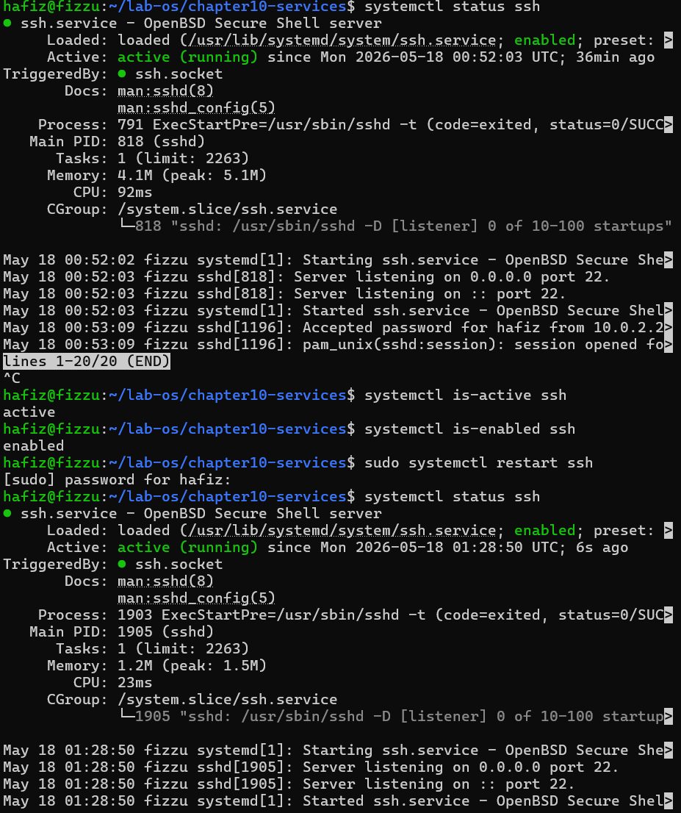

### Tantangan
Buat skrip Bash (referensi Bab 7) bernama cek-layanan.sh yang memeriksa status daftar layanan
dari sebuah berkas teks. Berkas teks daftar-layanan.txt berisi satu nama layanan per baris (isi minimal: ssh, cron, rsyslog). Skrip membaca setiap nama layanan, memeriksa statusnya dengan systemctl is-active, lalu menulis laporan ke berkas laporan-layanan.log dengan format: [TANGGAL] nama-layanan: ACTIVE/INACTIVE. Gunakan date untuk mendapatkan tanggal.

### Jawaban
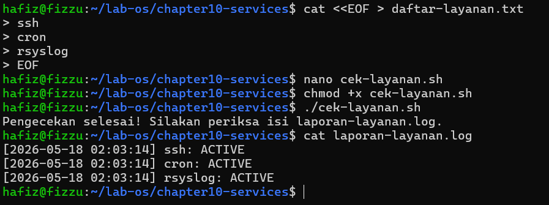

## Praktek 10.3 Buat Layanan Sederhana dari Skrip Bash

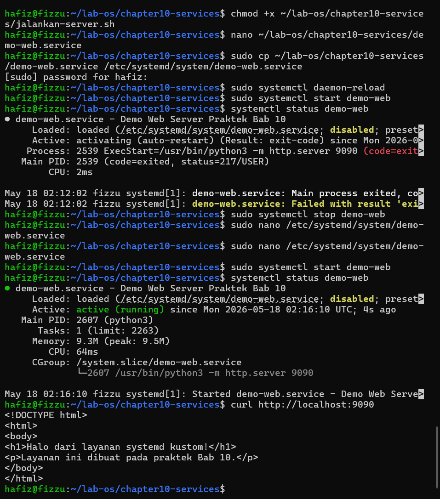

### Tantangan

Modifikasi berkas unit demo-web.service sebelum menghapusnya: tambahkan RestartSec=10s agar sistemmenunggu 10 detik sebelum mencoba restart, dan tambahkan Environment="PORT=9091" lalu ubah ExecStart agar menggunakan variabel tersebut. Aktifkanlayanan dengan enable dan WantedBy=multi-user.target, lalu uji apakah layanan aktif setelah systemctl daemon-reload. Dokumentasikan perbedaan perilaku dibanding versi sebelumnya.

### Jawaban
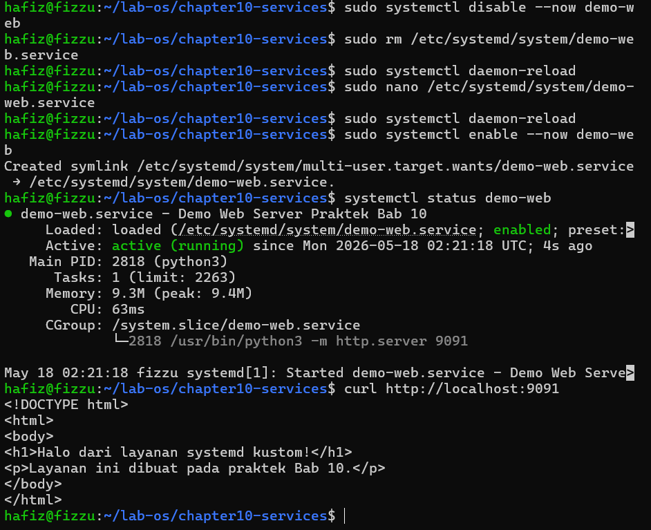

Pada versi sebelumnya, layanan berjalan secara statis di port 9090. Sekarang, menggunakan variabel Environment="PORT=9091". Karena ExecStart sekarang diubah untuk memanggil variabel $PORT, layanan web server berpindah mendengarkan di port 9091.

## Praktek 10.4 Filter dan Analisis Log Layanan

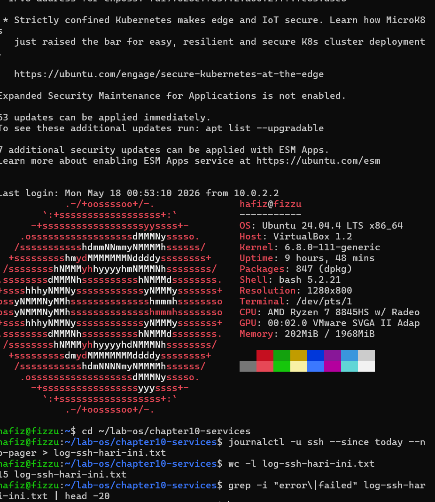

### Tantangan
Ekstrak semua log dengan prioritas error (-p err) dari 24 jam terakhir untuk layanan SSH, simpan ke berkas error-ssh-24jam.txt. Gunakan pipeline dari Bab 3 untuk menghitung total jumlah baris error dengan wc -l, lalu tampilkan 10 pesan error yang paling sering muncul menggunakan sort | uniq -c | sort -rn | head -10. Tuliskan perintah lengkap yang kamu gunakan.

### Jawaban
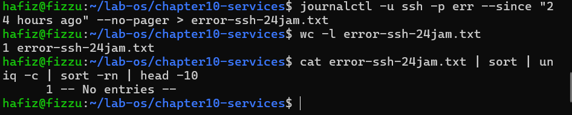

## Praktek 10.5 Konfigurasi SSH Server

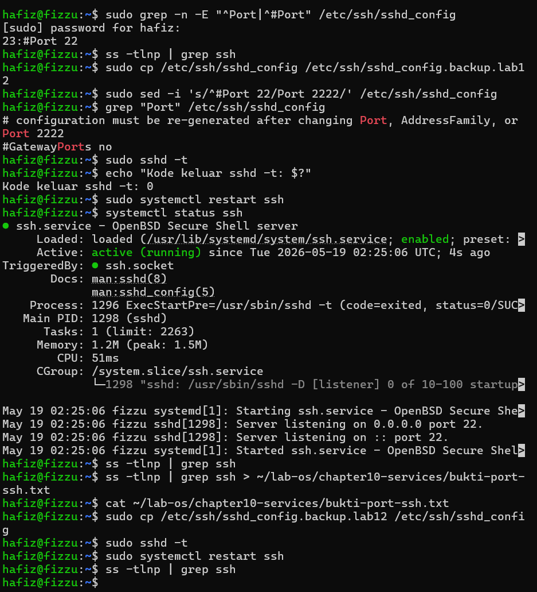

### Tantangan
Ubah konfigurasi SSH untuk menambahkan dua pengaturan keamanan: PermitRootLogin no (larang login root langsung) dan MaxAuthTries 3 (maksimal tiga kali percobaan). Lakukan dengan urutan yang aman: backup, edit, validasi dengan sshd -t, reload. Verifikasi perubahan dengan grep -E "PermitRoot|MaxAuth" /etc/ssh/sshd_config. Kemudian periksa log SSH untuk memastikan tidak ada error setelah perubahan dengan journalctl -u ssh -n 20. Referensi Bab 2 untuk penggunaan ss dan Bab 9 untuk keamanan pengguna.

### Jawaban
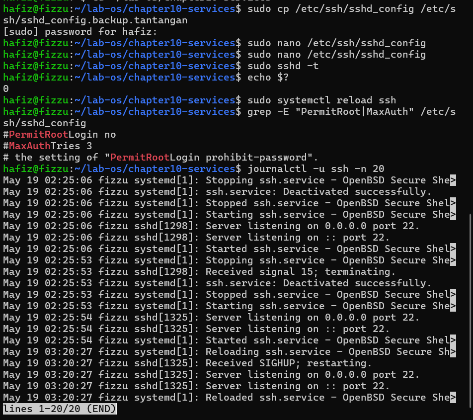

## Latihan 10.1 Audit Layanan dan Analisis Boot

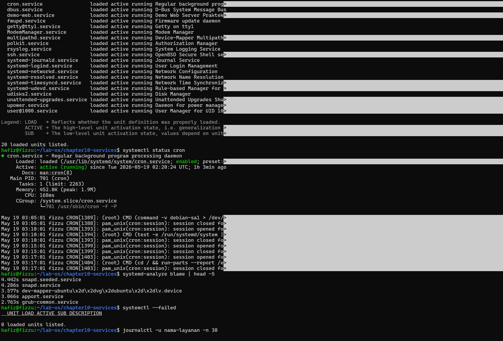

## Latihan 10.2 Layanan Kustom dengan Restart Otomatis
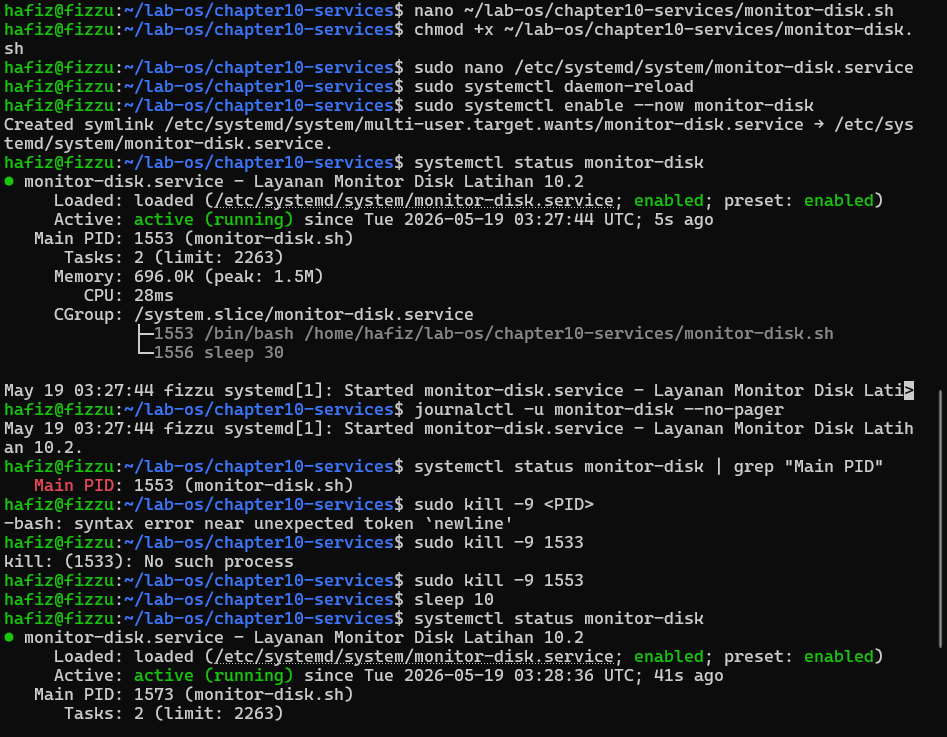

## Latihan 10.3 Investigasi Log dan Keamanan SSH

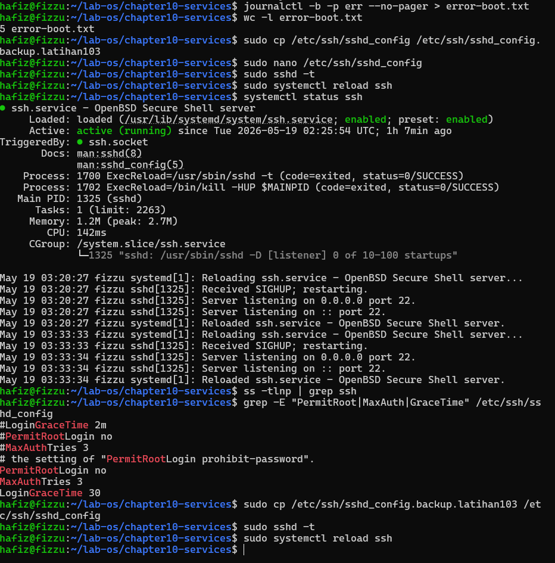