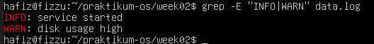
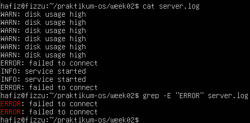
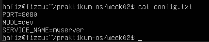
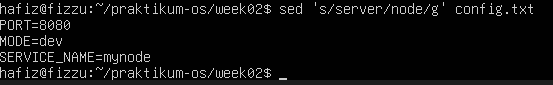
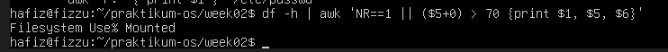
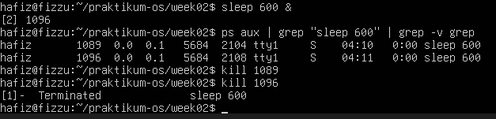
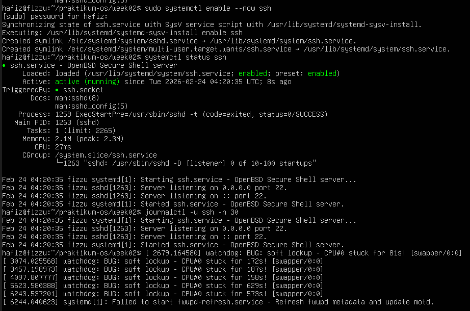

# Manajemen Perangkat Keras & Perintah Dasar Sistem Operasi
<h4>Nama    : Muhammad Hafiz<h4>
<h4>NIM     : 254107020056<h4>
<h4>Kelas   : TI -1H<h4>

## Latihan 2.1

### Pertanyaan
1. Catat: (1) jumlah CPU(s), core/thread, (2) total RAM, (3) total swap. Jelaskan perbedaan RAM vs swap dalam 2–3 kalimat.

### Jawaban 
1. Core : 1, Thread : 1
2. Total RAM    : 1.9 Gi
3. Total Swap   : 2.0 Gi
Perbedaan RAM dengan swap: RAM adalah penyimpanan utama yang sangat cepat untuk menjalankan aplikasi. Sedangkan swap adalah area di dalam disk (HDD/SSD) yang digunakan sebagai memori cadangan jika RAM sudah penuh. 

## Latihan 2.2 

### Pertanyaan 
1. Temukan 1 perangkat PCI (misal NIC) dan tuliskan: Vendor:Device ID (angka
heksadesimal), nama driver/modul kernel, dan deskripsi singkat fungsinya.

### Jawaban
1. Perangkat PCI    : Intel Corporation 82540EM Gigabit Ethernet Controller
Vendor: Device ID: 8086:100e
Driver/Modul Kernel: e1000.
Deskripsi Fungsi: Ini adalah kartu jaringan (NIC) yang berfungsi untuk menghubungkan mesin virtual ke jaringan internet atau LAN melalui koneksi Ethernet.

## Latihan 2.3

### Pertanyaan 
1. Dari output ls -l, jelaskan perbedaan penanda file untuk block device dan
character device. (Hint: karakter pertama pada permission string)

### Jawaban
1. perbedaan antara kedua jenis perangkat tersebut terletak pada karakter paling awal di baris keterangannya:

Block Device ditandai dengan karakter b pada awal string permission (seperti pada /dev/sda), yang berarti perangkat ini menyimpan dan mentransfer data dalam bentuk blok besar serta mendukung akses acak, seperti hardisk atau SSD.

Character Device ditandai dengan karakter c pada awal string permission (seperti pada /dev/tty), yang berarti perangkat ini menangani data sebagai aliran karakter secara berurutan, contohnya adalah terminal atau keyboard.

## Latihan 2.4

### Pertanyaan 
1. Gunakan grep untuk menampilkan hanya baris yang mengandung INFO atau
WARN dari data.log. (Hint: gunakan grep -E dengan pola alternatif)

### Jawaban
1. 

## Latihan 2.5

### Pertanyaan
1. Pilih satu port yang listening dari output ss -tulpn(misal port 22), lalu
tuliskan service/proses yang membukanya. Jelaskan kegunaan port tersebut
secara singkat.

# Jawaban
1. Saya memilih port 22. 
Fungsi Utama: Port 22 adalah standar global untuk protokol SSH. Protokol ini memungkinkan untuk mengontrol terminal komputer lain dari jarak jauh melalui jaringan.

Keamanan: Berbeda dengan Telnet yang mengirim data secara teks biasa, SSH mengenkripsi semua data yang dikirim, termasuk kata sandi, sehingga aman dari penyadapan.

## Latihan 2.A

### Pertanyaan 
1. Jalankan lspci -nnk. Pilih 1 perangkat PCI dan tuliskan: nama perangkat,
ID vendor:device, dan kernel driver in use.

### Jawaban
1. Nama Perangkat: Intel Corporation 82540EM Gigabit Ethernet Controller
ID vendor:device: [8086:100e]
Kernel driver in use: e1000

## Latihan 2.B

### Pertanyaan
1. Tentukan device root filesystem dengan findmnt /. Lalu cocokkan dengan
lsblk -f dan tuliskan tipe filesystem serta UUID-nya.

### Jawaban
1. Tipe Filesystem (FSTYPE): ext4
UUID: c0a4f722-8091-49ea-98ba-e669106778c0

## Latihan 2.C

### Pertanyaan
1. Buat file server.log berisi minimal 10 baris dengan variasi kata: INFO,
WARN, ERROR. Gunakan grep untuk menampilkan hanya baris ERROR

### Jawaban
1.

## Latihan 2.D

### Pertanyaan
1. Gunakan sed untuk mengganti semua kata server menjadi node pada file
latihan. Tunjukkan sebelum dan sesudah.

### Jawaban
1. Sebelum: 

Sesudah: 

## Latihan 2.E

### Pertanyaan
1. Gunakan df -h lalu awk untuk menampilkan filesystem yang penggunaan disk
di atas 70%.

### Jawaban
1. 

## Latihan 2.F

### Pertanyaan
1. Jalankan sleep 600 &. Temukan PID-nya dengan ps. Hentikan dengan
SIGTERM. Jelaskan beda SIGTERM vs SIGKILL.

### Jawaban
1. 
- SIGTERM -> Menghentikan proses secara normal (graceful).
- SIGKILL -> Memaksa proses berhenti langsung tanpa proses pembersihan.

## Latihan 2.G

### Pertanyaan
1. Gunakan systemctl –failed. Jika tidak ada yang gagal, pilih satu service
aktif (misal ssh) dan tampilkan status serta 30 baris log terakhirnya.

### Jawaban
1. 