#Operasi File dan Struktur Direktori
<h4>Nama    : Muhammad Hafiz<h4>
<h4>NIM     : 254107020056<h4>
<h4>Kelas   : TI -1H<h4>

## Tugas Pendahuluan

### Pertanyaan
1. Apa yang dimaksud perintah-perintah direktory: pwd, cd, mkdir, rmdir.
2. Apa yang dimaksud perintah-perintah manipulasi file: cp, mv, dan rm (sertakan format yang digunakan)
3. Jelaskan perbedaan symbolic link menggunakan hard link (direct) dan soft link (indirect)
4. Tuliskan maksud perintah-perintah: file, find, which, locate, dan grep

### Jawaban
1. - pwd: Berfungsi untuk menampilkan jalur lengkap dari direktori tempat user berada saat ini.
- cd: digunakan untuk berpindah dari satu direktori ke direktori lainnya.
- mkdir: Perintah untuk membuat direktori atau folder baru.
- rmdir: Berfungsi untuk menghapus direktori, tetapi dengan syarat direktori tersbeut harus kosong.

2. - cp: Digunakan untuk menyalin file atau direktori dari satu tempat ke tempat lain.
- mv : memiliki dua fungsi utama, yakni memindahkan file/direktori ke lokasi lain dan mengubah nama (rename) file/direktori
- rm : Digunakan untuk menghapus file atau direktori.

3. Perbedaan hard link dan soft link:
Hard Link: 
- Menunjuk langsung ke data fisik di dalam hard drive. File asli dan hard link pada dasarnya adalah file yang sama.
- Jika file asli dihapus, hard link tetap bisa dibuka dan data tetap utuh, karena ia memegang akses langsung ke data fisik tersebut.

Soft Link:
- Menunjuk ke jalur dari file asli. Bertindak seperti shortcut di Windows.
- Jika file asli dihapus, soft link akan rusak karena jalur menuju file asli sudah tidak ada.

4. Maksud dari perintah-perintah file, find, which, locate, dan grep:
- file: Berfungsi untuk menentukan jenis suatu file.
- find: Digunakan untuk mencari file atau direktori di dalma hierarki sistem secara real-time berdasarkan kriteria yang sangat spesifik (nama, ukuran, tanggal dimodifikasi, jenis izin, dll).
- locate: sama seperti find, ini digunakan untuk mencari letak file/direktori, namun locate jauh lebih cepat.
- grep: Perintah ini duganakan untuk mencari teks, kata, atau pola tertentu di dalam sebuah file.

## Percobaan 1: Direktory

### Jawaban
- 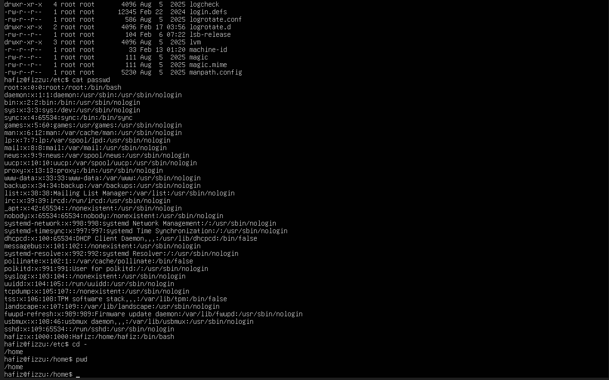

## Percobaan 2: Manipulasi File

### Jawaban
- 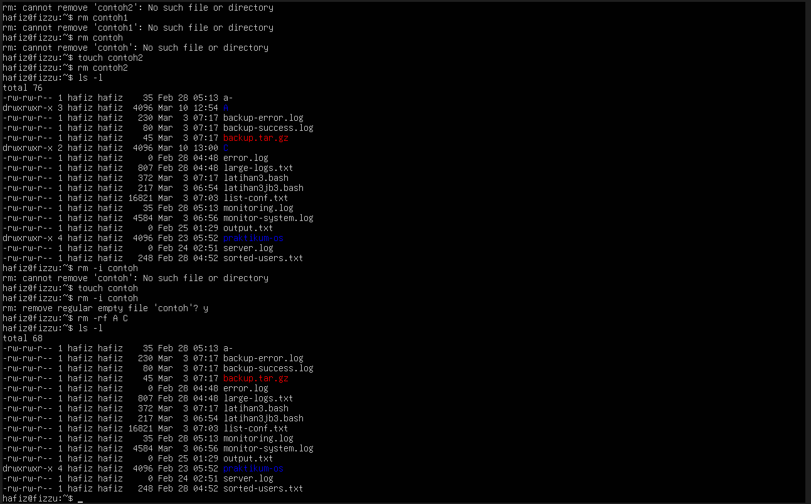

## Percobaan 3: Symbolic Link

### Jawaban
- 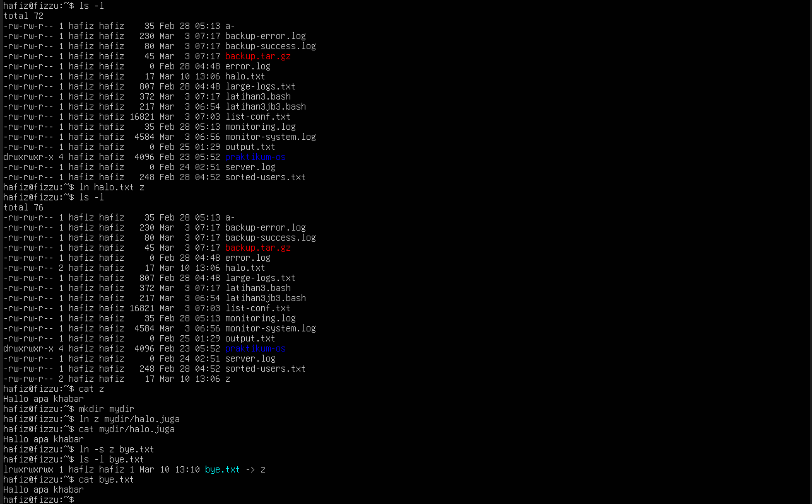

## Percobaan 4: Melihat Isi File

### Jawaban
- 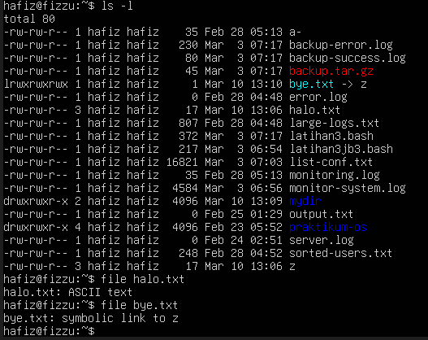

## Percobaan 5: 

### Jawaban
- 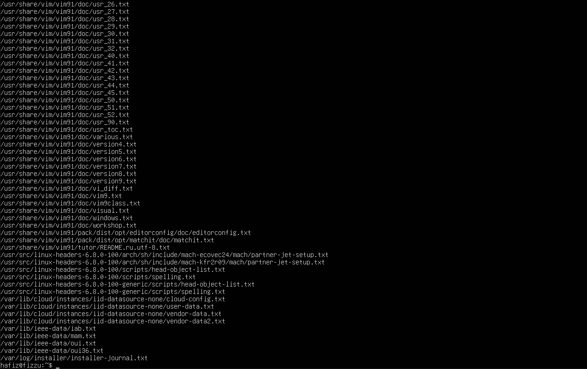

## Percobaan 6: Mencari Text Pada File
- 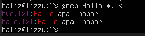

## Latihan

### Jawaban
1. 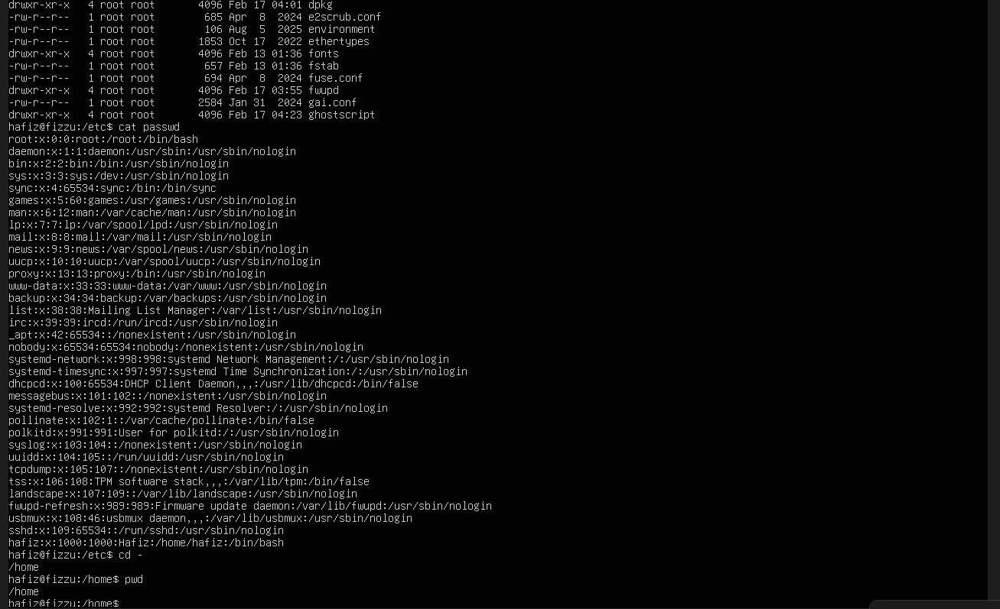
2. 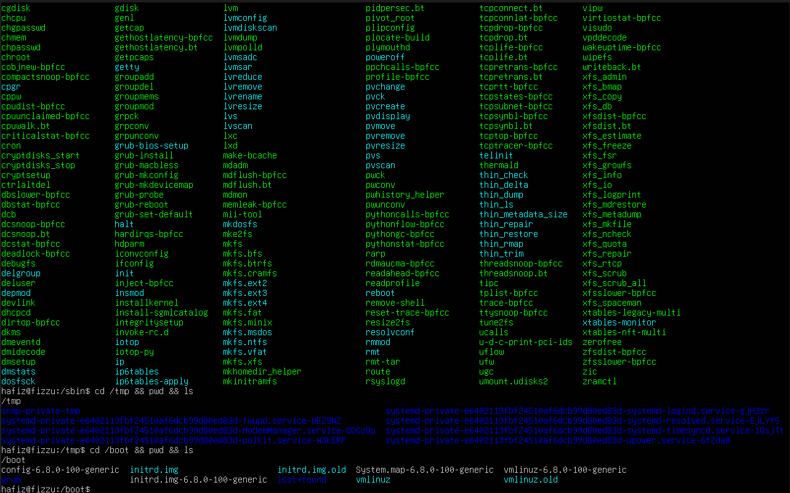
3. 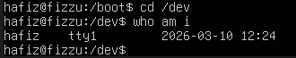
4. 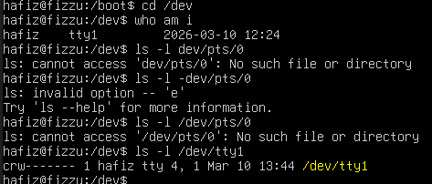
5. 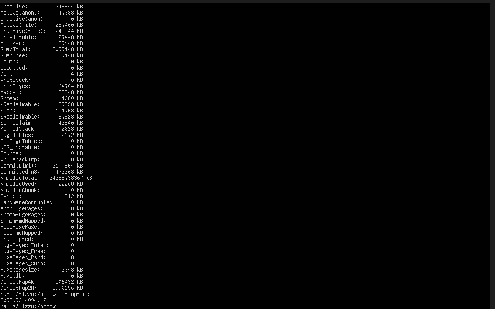
6. 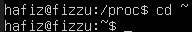
7. 
8. 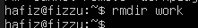
9. 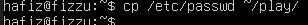
10. 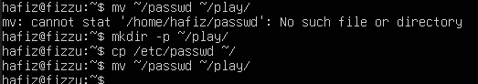
11. 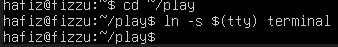
12. 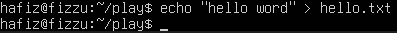
13. 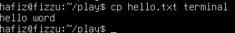
14. 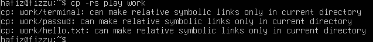
15. 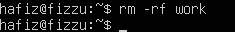

## Laporan Resmi
1. Analisa Hasil Percobaan
- Percobaan 1 (Direktori): Perintah pwd digunakan untuk melihat posisi direktori aktif saat ini, sedangkan echo $HOME menampilkan jalur mutlak direktori asal (home) user. Perintah cd tanpa argumen akan mengembalikan posisi ke direktori home. Perintah mkdir dan rmdir digunakan untuk membuat dan menghapus direktori.
- Percobaan 2 (Manipulasi File): Perintah cp berhasil menyalin file dan direktori. Perintah mv memindahkan atau merubah nama file. Perintah rm menghapus file, dan dengan opsi -rf dapat menghapus direktori beserta isinya secara paksa.
- Percobaan 3 (Symbolic Link): Pembuatan hard link (ln) membuat file baru yang identik secara data dengan file asli, di mana link count akan bertambah menjadi 2. Pembuatan soft link atau symbolic link (ln -s) membuat sebuah shortcut yang hanya menunjuk ke jalur file asli tanpa menambah link count asli.
- Percobaan 4, 5, 6 (Melihat dan Mencari File): Perintah file menampilkan jenis tipe dari suatu file secara deskriptif (misalnya ASCII text). Perintah find, which, dan locate berhasil digunakan untuk menelusuri letak file di dalam sistem. Perintah grep berfungsi memfilter teks spesifik dari dalam isi file.

2. Pohon Struktur File dan Direktori:
- 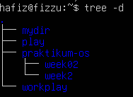
3. Analisa Pesan Error: 
- rmdir B: Menghasilkan error karena perintah rmdir hanya bisa digunakan untuk direktori kosong. Direktori B masih berisi subdirektori F.
- ls -1 B (setelah rmdir B/F B): Menghasilkan error karena direktori B sudah terhapus secara sukses pada baris perintah sebelumnya.
- cd /<user/C: Menghasilkan error "No such file or directory" karena format absolut path-nya salah (typo). Seharusnya tertulis /home/<user>/C.
- mv contoh contoh1 C: Menghasilkan error karena file contoh sudah diubah namanya menjadi contoh2 pada eksekusi perintah mv sebelumnya, sehingga file contoh sudah tidak eksis. 

4. Kerjakan latihan di atas dan analisa hasil tampilannya.
- Navigasi Dasar: Rangkaian perintah cd, pwd, dan ls -al menunjukkan perpindahan direktori menggunakan konsep relative path (., ..) dan absolute path (/etc). Perintah cd - berfungsi untuk kembali ke direktori sebelumnya.
- Penelusuran Direktori Sistem: Penelusuran pada direktori /bin, /usr/bin, /sbin, /tmp dan /boot menampilkan kumpulan utilitas sistem, program (binary), file konfigurasi sementara, dan file kernel esensial untuk booting Linux.
-Direktori /dev: Direktori ini menyimpan representasi perangkat keras (hardware) sebagai sebuah file. Perintah who am i menampilkan perangkat terminal virtual yang sedang digunakan.
- Direktori /proc: Direktori /proc disebut pseudo-filesystem karena ini bukanlah file sungguhan yang tersimpan di hard disk. Direktori ini dibuat secara dinamis di atas RAM oleh kernel untuk menyimpan informasi real-time tentang proses sistem, memori, dan perangkat.
- Pindah ke Home User Lain: Perintah cd ~username (misal cd ~root) mengarahkan path langsung ke direktori /root.
- Kembali ke Home: Perintah cd mengembalikan path ke /home/user.
- Membuat Subdirektori: mkdir work play berhasil membuat dua folder.
- Menghapus Subdirektori: rmdir work berhasil menghapus folder work karena folder tersebut kosong.
- Salin File: cp /etc/passwd ~/ menyalin file passwd dari /etc ke direktori home pengguna.
- Pindah File: mv ~/passwd ~/play/ memindahkan file tersebut masuk ke dalam folder play.
- Symbolic Link Terminal: Hard link tidak bisa digunakan untuk menunjuk ke perangkat file (device file) seperti tty (atau melintasi partisi yang berbeda). Oleh karena itu, kita harus menggunakan symbolic link (ln -s).
- Input Perintah Lanjutan: Jika kita melakukan cp terminal hello.txt, kita menyalin input langsung dari terminal (keyboard) ke dalam file, menghasilkan efek yang sama seperti menggunakan utilitas pembuat teks.
- Menyalin ke Terminal: Perintah cp hello.txt terminal akan menyalin isi file ke representasi layar terminal. Efeknya, isi tulisan "hello word" dari file tersebut akan tercetak/ditampilkan langsung di layar.
- Salin Direktori via Symlink: Menggunakan cp -rs play work akan menyalin direktori secara rekursif, namun alih-alih menyalin data aslinya, ia menciptakan symbolic link di dalam folder work yang menunjuk ke file di folder play.
- Hapus Paksa: Perintah rm -rf work digunakan untuk menghapus paksa direktori work beserta seluruh file/shortcut yang ada di dalamnya hanya dengan satu baris instruksi.
5. Kesimpulan: 
- Kesimpulan dari praktikum ini adalah bahwa sistem operasi Linux memiliki struktur organisasi file yang bersifat hierarkis menyerupai pohon (tree), di mana seluruh susunan direktori dan subdirektori bermula dari satu titik utama yang disebut direktori root (/). Dalam konsep ekosistem Linux, direktori pada dasarnya merupakan sebuah file khusus yang menyimpan informasi nama file beserta penunjuk (INODE) ke data aslinya , dan bahkan perangkat keras (seperti harddisk atau mouse) juga direpresentasikan sebagai file di dalam direktori /dev. Untuk mengelola sistem file tersebut, pengguna dapat memanfaatkan berbagai perintah dasar antarmuka baris perintah (CLI) yang efisien, seperti mkdir dan rmdir untuk membuat dan menghapus direktori tingkat dasar, serta cp, mv, dan rm untuk menyalin, memindah, dan menghapus file.