# MANAJEMEN PROSES
<h4>Nama    : Muhammad Hafiz<h4>
<h4>NIM     : 254107020056<h4>
<h4>Kelas   : TI -1H<h4>

## Latihan 6.1

### Pertanyaan
Jalankan ps aux dan amati outputnya:
1. Berapa total proses yang berjalan? Proses apa yang memiliki PID
terkecil?
2. Jalankan pstree -p dan temukan proses bash Anda. Proses apa yang menjadi induk (PPID) dari bash tersebut?
3. Bandingkan output ps aux dan ps aux -L. Apa perbedaan yang Anda
lihat?

### Jawaban
1. Total proses yang berjalan ada 94 proses. PID terkecil adalah PID 1 /sbin/init
- 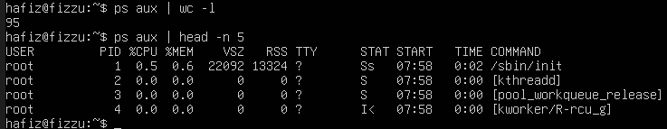
2.  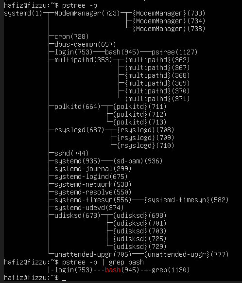
3. ps aux: Hanya menampilkan daftar proses utama. Jika sebuah program memiliki banyak thread di latar belakang, program tersebut umumnya tetap hanya ditampilkan sebagai satu baris.
ps aux -L: Menampilkan proses beserta seluruh thread (utas) yang berjalan di dalam proses tersebut.

## Latihan 6.2

### Pertanyaan
1. Jalankan sleep 120 & dan amati kolom STAT pada ps aux. Kondisi
apa yang ditampilkan? Mengapa proses sleep berada di kondisi tersebut?
2. Jalankan beberapa perintah yang berhasil dan yang gagal, lalu catat exit
code masing-masing. Pola apa yang Anda temukan?

### Jawaban
1.  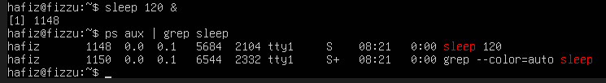
Proses ini berada dalam kondisi sleep (tidur) karena tugas dari perintah sleep memang hanya untuk menunggu/berhenti sejenak selama waktu yang ditentukan (120 detik). Selama masa tunggu tersebut, proses tidak melakukan komputasi apa pun dan tidak menggunakan CPU, sehingga sistem operasi mengalihkannya ke status sleep menunggu waktu habis (atau sampai diinterupsi oleh sinyal lain).
2. 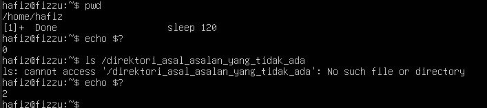
Jika perintah berhasil tanpa error maka exit code selalu bernilai 0
Jika perintah gagal, exit code akan bernilai selain 0

## Latihan 6.3

### Pertanyaan
1. Jalankan nice -n 5 sleep 200 & dan verifikasi nilai NI-nya dengan ps.
2. Ubah nilai nice menjadi 10 menggunakan renice, lalu verifikasi kembali.
3. Coba ubah nilai nice menjadi -5 tanpa sudo. Apa yang terjadi? Mengapa Linux membatasi hal ini untuk user biasa?

### Jawaban
1. 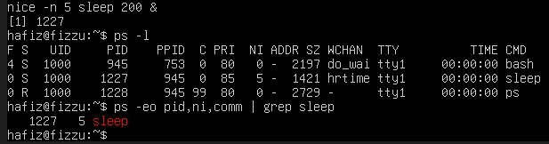
2. 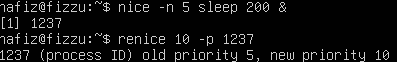
3. 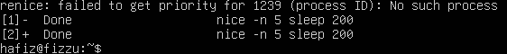
Di dalam sistem operasi Linux, nilai nice menentukan prioritas proses di CPU. Nilai yang lebih kecil atau negatif (-1 hingga -20) berarti proses tersebut menuntut prioritas yang lebih tinggi dari CPU.

## Latihan 6.4

### Pertanyaan
1. Jalankan sleep 400 &, kirim SIGSTOP, dan amati perubahan kolom
STAT. Kondisi apa yang muncul?
2. Kirim SIGCONT dan verifikasi proses kembali berjalan.
3. Hentikan proses dengan SIGTERM lalu verifikasi sudah tidak ada. Kapan Anda memilih SIGKILL daripada SIGTERM?

### Jawaban
1. Kondisi yang muncul pada kolom STAT adalah huruf T. Ini menandakan bahwa proses sedang dalam status Stopped (Terhenti/Jeda). Prosesnya belum mati atau terhapus dari sistem, hanya saja eksekusinya dihentikan sementara (di-pause) oleh sistem operasi.
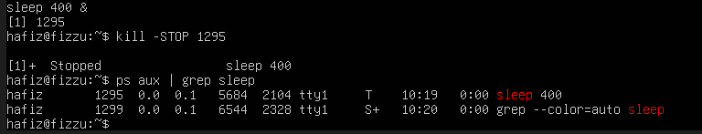
2. Huruf pada kolom STAT akan berubah kembali menjadi S (Interruptible Sleep), yang berarti proses tersebut sudah tidak lagi dijeda dan kembali menjalankan tugasnya (menunggu sisa waktu sleep).
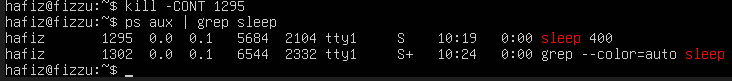
3. Sebaiknya selalu menggunakan SIGTERM (sinyal 15) terlebih dahulu. SIGTERM meminta program untuk berhenti secara "baik-baik" (graceful exit), sehingga program punya waktu untuk menyimpan data sementara, menutup file yang terbuka, dan membersihkan memori.
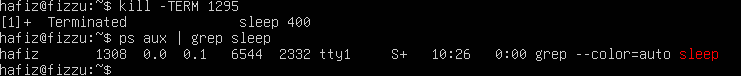

## Latihan 6.5

### Pertanyaan
1. Jalankan top di foreground. Apa yang terjadi di terminal?
2. Tekan Ctrl+Z dan cek statusnya dengan jobs. Kondisi apa yang
ditampilkan?
3. Pindahkan ke background dengan bg. Apakah top dapat berjalan dengan
baik di background? Mengapa?
4. Kembalikan ke foreground dengan fg, lalu keluar dengan q.

### Jawaban
1. Layar terminal akan langsung dipenuhi oleh antarmuka program top. Terminal akan menampilkan pemantauan sistem secara real-time (terus diperbarui setiap beberapa detik), meliputi penggunaan CPU, RAM, dan daftar proses yang sedang berjalan.
2. Pada output perintah jobs, user akan melihat status proses top tertulis sebagai Stopped (Terhenti). Contoh outputnya: [1]+  Stopped top. Perintah Ctrl+Z fungsinya memang untuk mengirimkan sinyal SIGTSTP yang menjeda (pause) proses dan mengembalikannya ke latar belakang sementara.
3. Tidak. Program top tidak bisa berjalan secara normal di background.Karena top adalah program interaktif yang secara terus-menerus perlu menulis/menampilkan pembaruan antarmuka ke layar terminal (Standard Output) dan menunggu input dari keyboard (Standard Input). Ketika sebuah program diletakkan di background, Linux akan mencabut hak akses program tersebut untuk berinteraksi dengan layar terminal. Akibatnya, saat top mencoba memperbarui layarnya dari background, sistem operasi akan langsung memblokirnya dan mengirimkan sinyal untuk menghentikannya lagi.

## Latihan 6.6

### Pertanyaan
1. Gunakan ps aux –sort=%mem untuk menemukan proses yang menggunakan memori paling banyak di VM Anda. Proses apa itu?
2. Di dalam top, tekan 1 . Apa yang berubah pada tampilan? Mengapa informasi ini berguna?
3. Di dalam htop, navigasikan ke proses sshd menggunakan tombol panah. Tekan F9 dan amati opsi sinyal yang tersedia.

### Jawaban
1. Proses tersebut adalah proses yang menggunakan memori paling banyak
2. Baris informasi CPU di bagian atas layar akan berubah/memuai. Awalnya, top hanya menampilkan satu baris ringkasan total (%Cpu(s)). Setelah menekan 1, tampilannya akan terpecah menampilkan persentase penggunaan untuk setiap inti (core) CPU secara individual. Informasi ini sangat berguna untuk memantau efisiensi program. User bisa menganalisis apakah sebuah proses membebani seluruh core secara merata (seperti pada program multi-threading), atau malah terjadi bottleneck (kemacetan) di mana hanya satu core saja yang bekerja keras (mencapai 100%) sementara core yang lain menganggur.
3. Saat menekan F9, sebuah menu atau panel pop-up di sebelah kiri layar bernama "Send signal" akan muncul. Beberapa sinyal penting yang akan kamu lihat di antaranya adalah:

- 15 SIGTERM (Sinyal default yang disorot pertama kali, untuk menghentikan program dengan aman).

- 9 SIGKILL (Sinyal untuk membunuh program secara paksa saat itu juga).

- 19 SIGSTOP (Untuk menjeda program).

- 18 SIGCONT (Untuk melanjutkan program yang dijeda).

- Dan puluhan sinyal sistem lainnya seperti SIGHUP (1), SIGINT (2), dll.

## Latihan 6.A

### Pertanyaan 
1. Jalankan ps aux –forest dan temukan proses dengan PID 1. Apa
nama dan fungsi proses tersebut dalam sistem Linux modern?
2. Hitung berapa proses yang dimiliki oleh user root dan berapa yang dimiliki oleh user Anda. Mengapa root memiliki lebih banyak proses?
3. Temukan semua proses yang berada dalam kondisi S. Mengapa sebagian besar proses di sistem berada dalam kondisi ini?

### Jawaban
1. ada sistem Linux modern (seperti Ubuntu, Debian, CentOS baru), nama prosesnya biasanya adalah systemd (terkadang masih tertulis sebagai /sbin/init yang sebenarnya merupakan symlink ke systemd). stemd (atau init) adalah proses pertama (induk dari segala proses) yang dijalankan oleh kernel Linux saat komputer baru menyala (booting). Fungsinya sangat vital, yaitu:

- Menginisialisasi sistem dan hardware. 
- Menjalankan berbagai layanan sistem (services) dan daemons di latar belakang.
- Mengelola dan mengawasi seluruh proses lain di dalam sistem operasi. Jika ada proses yang kehilangan induknya (orphaned process), systemd akan mengambil alih proses tersebut.
2. 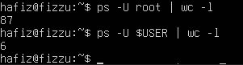

- User root adalah superuser atau administrator tertinggi di Linux. Sebagian besar tugas sistem operasi berjalan di bawah hak akses root. Ini termasuk menjalankan kernel threads (proses inti sistem), mengelola memori, driver perangkat keras, koneksi jaringan, sistem keamanan, hingga layanan latar belakang (daemons) seperti SSH, web server, dan logging.
3. 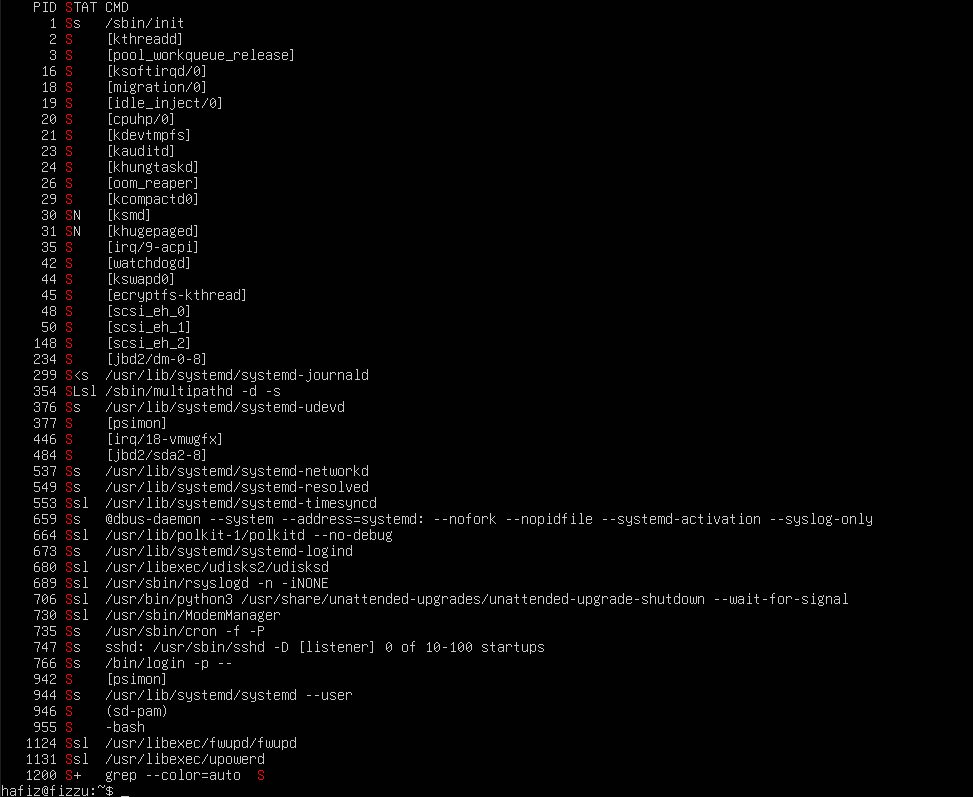
- Huruf S menandakan Interruptible Sleep. Sebagian besar program di komputer tidak melakukan perhitungan/komputasi secara terus-menerus tiada henti. Mereka menghabiskan lebih banyak waktu untuk "menunggu".

## Latihan 6.B 

### Pertanyaan
1. Jalankan tiga perintah sleep dengan durasi 100, 200, dan 300 detik di background. Verifikasi ketiganya dengan jobs.
2. Bawa job kedua ke foreground, jeda dengan Ctrl+Z , lalu kembalikan ke background dengan bg.
3. Hentikan job pertama dengan kill %1. Tampilkan kembali daftar job. Berapa job yang tersisa?

### Jawaban 
1. 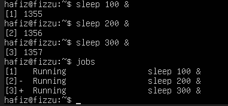
2. 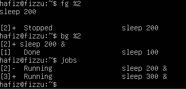
3. 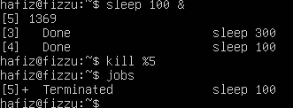

## Latihan 6.C

### Pertanyaan 
1. Jalankan dua proses sleep: satu dengan nice +5 dan satu dengan nice +15. Verifikasi nilai NI keduanya dengan ps.
2. Gunakan renice untuk mengubah nice proses pertama menjadi +10.
Proses mana yang kini lebih diprioritaskan scheduler?
3. Kirim SIGSTOP ke salah satu proses, verifikasi kondisi T-nya, lalu kirim SIGCONT. Akhiri semua proses percobaan dengan pkill sleep.

### Jawaban 
1. 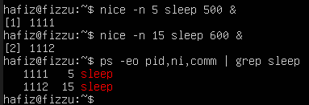
2. 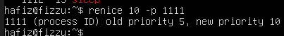
3. 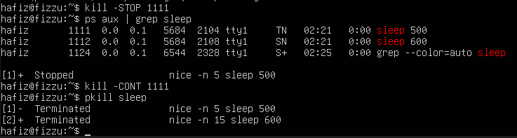