# BASH SHELL DAN SHELL BASIC
<h4>Nama    : Muhammad Hafiz<h4>
<h4>NIM     : 254107020056<h4>
<h4>Kelas   : TI -1H<h4>

## Tugas Praktikum 1: Toolkit Bash Administrator Pribadi

### Pertanyaan 
1. Tambahkan konfigurasi pada .bashrc untuk:
- menambahkan direktori bin pribadi ke PATH,
- membuat minimal 2 alias yang membantu kerja harian,
- membuat minimal 1 fungsi shell yang berguna untuk administrasi.
2. Pastikan konfigurasi tersebut aktif kembali saat membuka shell login.
3. Buat satu script sederhana di direktori bin pribadi, misalnya script untuk menampilkan ringkasan sistem.
4. Uji dari direktori yang berbeda untuk memastikan script dapat dipanggil tanpa menuliskan path lengkap.
5. Simpan bukti pengujian ke file toolkit-bash-report.txt.
Minimal luaran:
- isi blok konfigurasi yang ditambahkan ke .bashrc,
- output echo $PATH,
- output type untuk alias, fungsi, dan script,
- file laporan toolkit-bash-report.txt.

### Jawaban
1. Hasil dari langkah 1 hingga 3: 
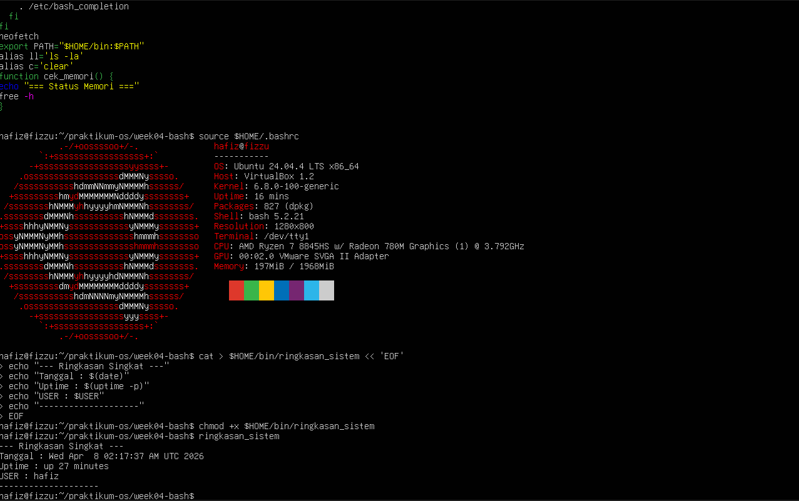
2. Hasil dari langkah 4 hingga 5:
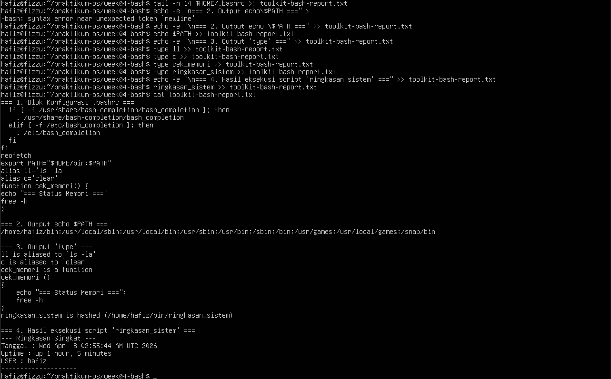

## Tugas Praktikum 2: Audit File Konfigurasi dan Logging Aman

### Pertanyaan
1. Buat file laporan bernama audit-konfigurasi-$(date +%F).txt.
2. Cari file *.conf di dalam /etc dan simpan hasilnya ke file laporan.
3. Catat jumlah total file konfigurasi yang ditemukan.
4. Jika ada pesan error, simpan ke file terpisah, misalnya audit-error.log.
5. Tampilkan isi laporan ke terminal dan sekaligus simpan menggunakan tee.
6. Tambahkan ringkasan singkat 3–5 baris yang menjelaskan mengapa pemisahan
stdout dan stderr penting dalam audit sistem.
Syarat konsep yang harus muncul:
- redirection >, 2>, atau &>,
- pipeline,
- tee,
- penggunaan variabel atau command substitution.
Minimal luaran:
- file laporan audit,
- file log error,
- perintah yang digunakan,
- analisis singkat hasil audit.

### Jawaban
1. Hasil dari langkah 1:
Hasil dari langkah 1 hingga 3: 
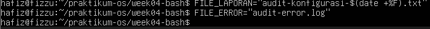
2. Hasil dari langkah 2 & 4:
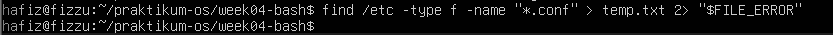
3. Hasil dari langkah 3: 
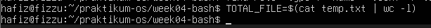
4. Hasil dari langkah 5 & 6:
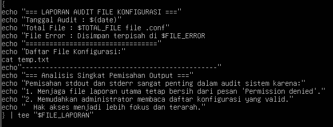
5. Minimal luaran:
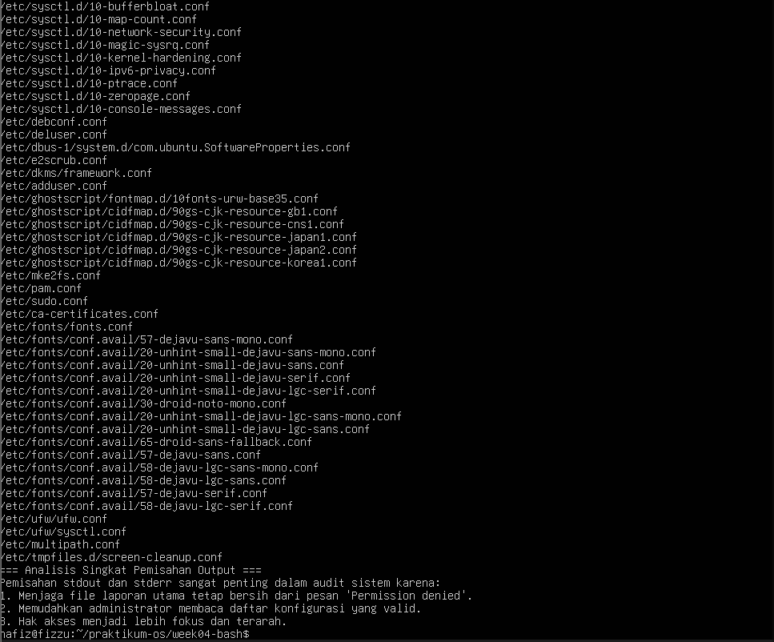
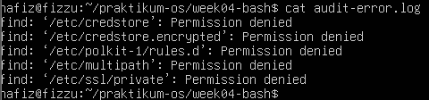
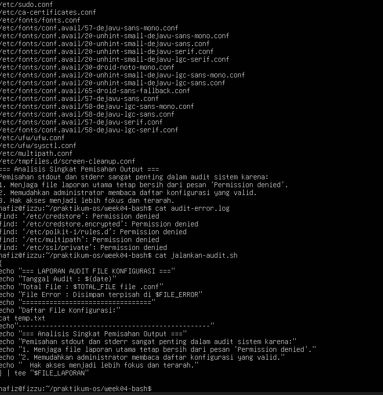

## Tugas Praktikum 3: Mini Health Check Harian Server

### Pertanyaan 
1. Buat script Bash bernama daily-healthcheck pada direktori bin pribadi.
2. Script minimal harus menampilkan:
- tanggal dan waktu,
- hostname,
- user aktif,
- shell aktif,
- uptime,
- penggunaan memori,
- penggunaan filesystem root,
- 10 baris terakhir history command yang relevan dengan pengecekan.
3. Simpan hasil ke file log harian, misalnya healthcheck-$(date +%F).log.
4. Tampilkan hasil ke terminal dan ke file secara bersamaan.
5. Jika Anda menggunakan pipeline dengan tee, cek juga status exit command
Syarat konsep yang harus muncul:
- environment variable,
- PATH,
- alias atau fungsi pendukung,
- history,
- tee,
- penanganan error dasar.
Minimal luaran:
- file script yang executable,
- contoh isi file log hasil eksekusi,
- penjelasan singkat fungsi tiap bagian script

### Jawaban 
- Environment Variable & PATH: Script ini menggunakan variabel bawaan sistem seperti $USER, $HOSTNAME, $SHELL, dan mencetak $PATH untuk melihat jalur eksekusi sistem pengguna saat itu.
- Penanganan Error Dasar: Terdapat logika if [ ! -d ... ] yang mengecek apakah folder tujuan penyimpanan log tersedia. Jika perintah mkdir gagal, exit 1 akan menghentikan script agar tidak berlanjut dalam kondisi error.
- Fungsi Pendukung: Dibuat fungsi cetak_pemisah() yang berisi perintah echo "---..." untuk merapikan pembatas antar blok informasi, sehingga script lebih efisien dan tidak perlu mengulang pengetikan garis panjang.
- History: Menggunakan set -o history dan history -r untuk memaksa Bash membaca file .bash_history sehingga perintah history | tail -n 10 bisa bekerja normal di dalam script non-interactive.
- eline & Tee dengan Cek Status: Menggunakan blok kurung kurawal { ... } untuk menyatukan semua output, lalu disalurkan | ke program tee agar tampil di layar sekaligus tersimpan ke file. Keberhasilan proses ini divalidasi menggunakan variabel ${PIPESTATUS[0]}.

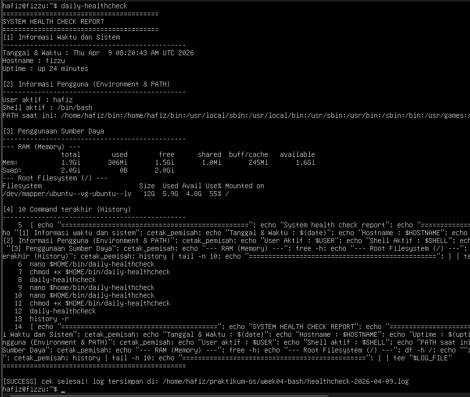

## Tugas Praktikum 4: Penanganan File dengan Nama Kompleks dan Arsip Aman

### Pertanyaan 
1. Buat minimal 4 file contoh dengan nama yang bervariasi, termasuk:
- nama file yang mengandung spasi,
- nama file yang mengandung tanda kurung siku atau karakter khusus,
- file dengan pola nama serupa untuk diuji dengan wildcard.
2. Tunjukkan perbedaan hasil jika file diakses tanpa quoting dan dengan quoting yang benar.
3. Lakukan preview wildcard dengan echo sebelum dipakai untuk operasi nyata.
4. Salin file-file tersebut ke direktori backup dengan nama yang aman.
5. Buat arsip tar.gz dari hasil backup.
6. Simpan riwayat perintah yang Anda gunakan ke file riwayat-arsip.txt. 
Syarat konsep yang harus muncul:
- single quote, double quote, dan escaping,
- wildcard,
- variabel path,
- history,
- operasi file lanjutan yang aman.
Minimal luaran:
- daftar file awal,
- daftar file hasil backup,
- file arsip tar.gz,
- file riwayat-arsip.txt,
- refleksi singkat tentang pentingnya quoting di Bash.

### Jawaban 
1. Hasil dari langkah 1:
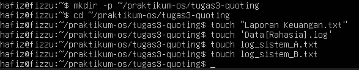
2. Hasil dari langkah 2:
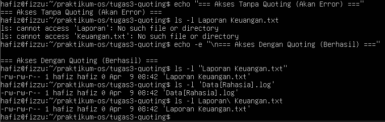
3. Hasil dari langkah 3: 
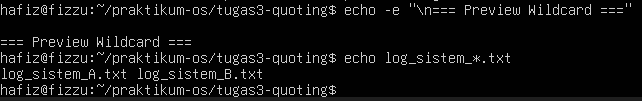
4. Hasil dari langkah 4:
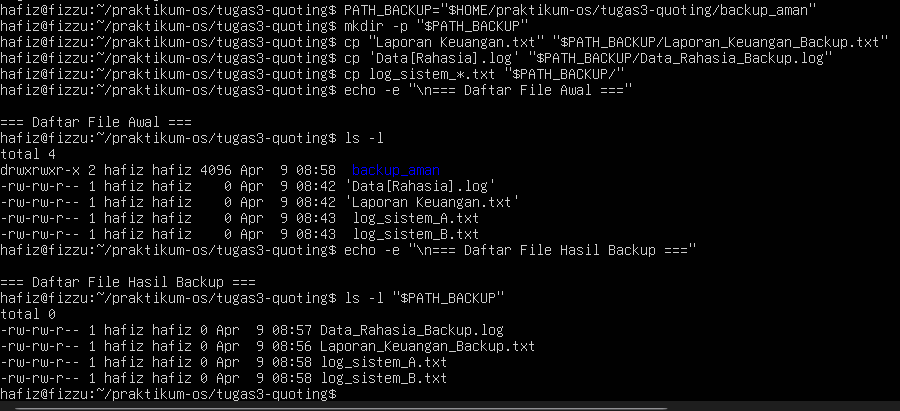
5. Hasil dari langkah 5:
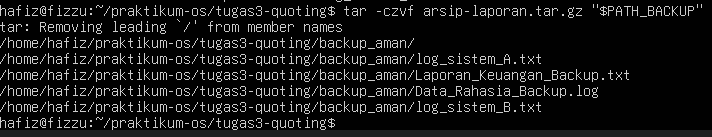
6. Hasil dari langkah 6 & 7:
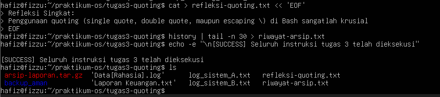