# PEMROGRAMAN BASH
<h4>Nama    : Muhammad Hafiz<h4>
<h4>NIM     : 254107020056<h4>
<h4>Kelas   : TI -1H<h4>

## Praktikum 7.1 Script Pertama: Laporan Sistem
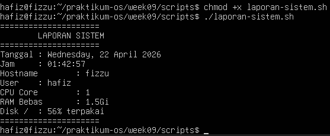

## Latihan 9.1

### Pertanyaan
Modifikasi laporan-sistem.sh agar menyimpan output ke file
laporan-YYYY-MM-DD.txt sekaligus menampilkannya di terminal. Petunjuk:
gunakan tee yang sudah dipelajari di bab sebelumnya.

### Jawaban
1. 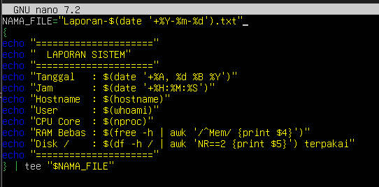
2. 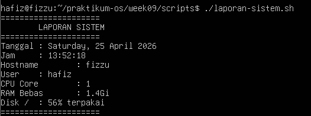

## Praktikum 7.2 Script Info dengan Argumen
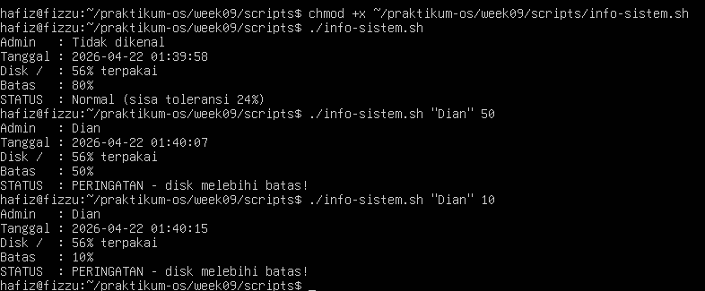

## Latihan 9.2

### Pertanyaan
Buat script kalkulator.sh yang menerima tiga argumen: angka1
operator angka2 dengan operator +,-, *, atau /. Contoh:
./kalkulator.sh 20 + 5 menghasilkan 25. Gunakan caseuntuk memilih
operasi, dan validasi jika argumen tidak lengkap.

### Jawaban
1. 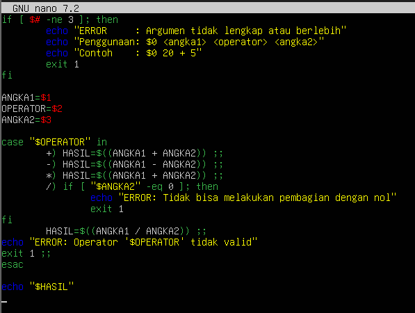
1. 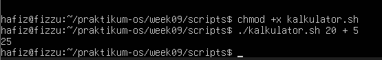

## Praktikum 7.3 Script Grading dan Menu Interaktif
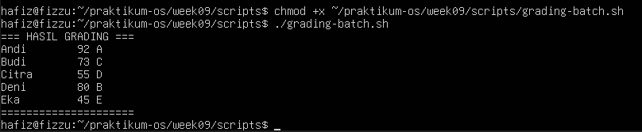
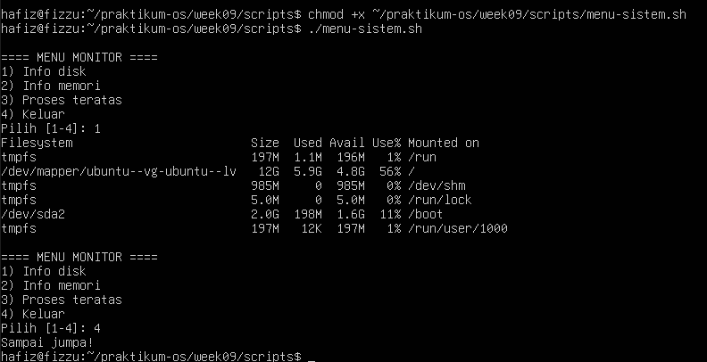

## Latihan 9.3

### Pertanyaan
Tambahkan ke script grading-batch.sh sebuah ringkasan di bagian bawah
yang menampilkan: jumlah mahasiswa per grade (A, B, C, D, E) menggunakan
perulangan for kedua yang mengiterasi array MAHASISWA.

### Jawaban
1. 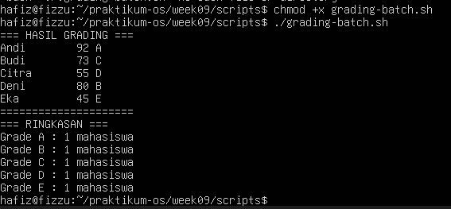

## Praktikum 7.4 Library Fungsi Validasi
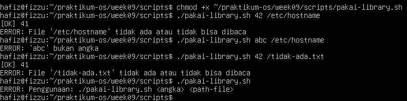

## Latihan 9.4

### Pertanyaan
Tambahkan fungsi konfirmasi() ke lib-validasi.sh. Fungsi ini
menampilkan pertanyaan, membaca input Y/N dari user, mengembalikan
0 jika Y dan 1 jika N. Buat script demo yang memanggil fungsi ini sebelum
menghapus sebuah file.

### Jawaban
1. 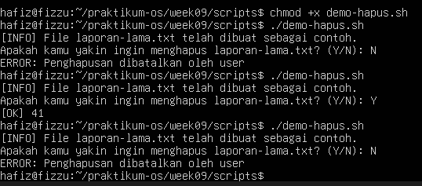

## Praktikum 7.5 Pengolahan Argumen Command Line
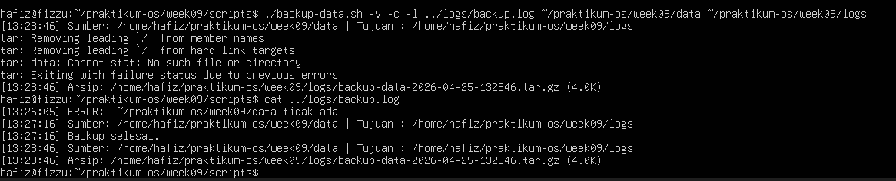

## Praktikum 7.6 Debugging Script
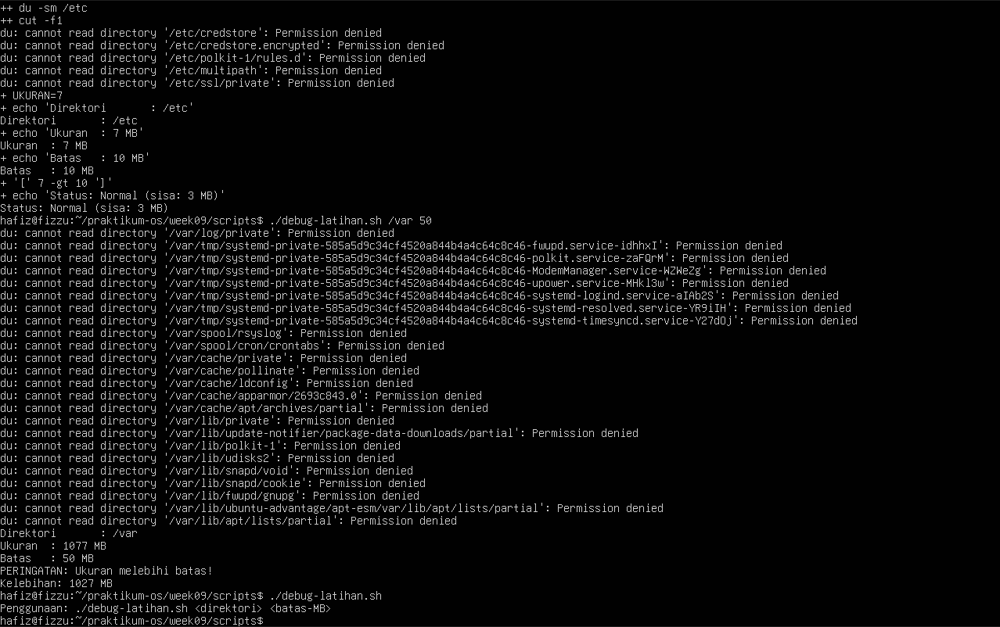

### Pertanyaan
Script debug-latihan.sh tidak menangani direktori yang tidak ada. Perbaiki
dengan menambahkan:
- set -e di baris kedua
- Pengecekan -d "$DIREKTORI" sebelum memanggil du
- Pesan error yang informatif jika direktori tidak ditemukan Uji dengan direktori yang tidak ada.

### Jawaban
1. 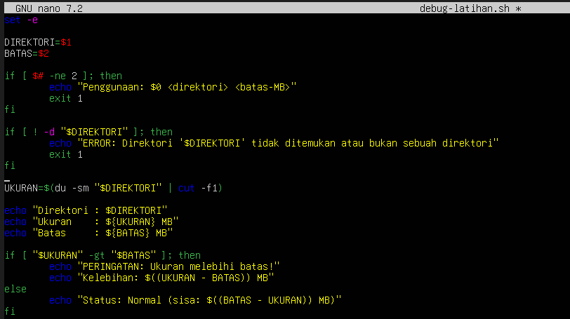
2. 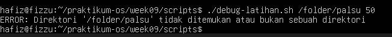

## Tugas 1 Script Absensi Kelas
Konteks: instruktur mencatat kehadiran mahasiswa dari command line.
Instruksi:
1. Buat script absensi.sh yang:
- Menerima argumen nama mahasiswa dan status (hadir/izin/alpha)
- Menyimpan entri ke absensi-YYYY-MM-DD.txt dengan format [HH:MM]
NAMA - STATUS
- Opsi -r: tampilkan rekapitulasi (jumlah per status)
- Opsi -h: tampilkan bantuan
2. Rekam minimal 5 entri dan tampilkan rekapitulasinya.
Konsep wajib: variabel, parameter posisional, getopts, if, for, fungsi, dan redirection ke file.

### Jawaban
 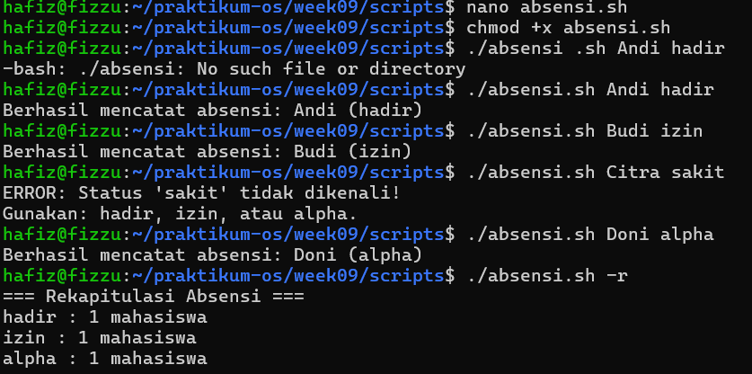

 ## Tugas 2 Script Healthcheck Sistem
Instruksi:
1. Buat script healthcheck.sh menggunakan template profesional dari bagian
Best Practices.
2. Script menampilkan: tanggal/waktu, hostname, uptime, penggunaan CPU,
memori, dan disk untuk setiap filesystem yang terpasang.
3. Jika penggunaan disk mana pun melebihi 80%, tampilkan peringatan.
4. Simpan hasil ke healthcheck-YYYY-MM-DD.log dan tampilkan ke terminal
sekaligus menggunakan tee.
5. Opsi -t <persen> mengubah batas peringatan disk (default 80).
Konsep wajib: set -euo pipefail, trap, getopts, fungsi dengan local,
for, if, dan tee.

### Jawaban
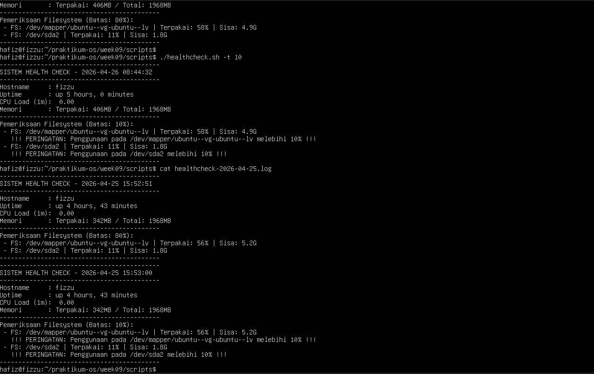