# UAS SISTEM OPERASI
<h4>Nama    : Muhammad Hafiz<h4>
<h4>NIM     : 254107020056<h4>
<h4>Kelas   : TI-1H<h4>

## 1. Persiapan
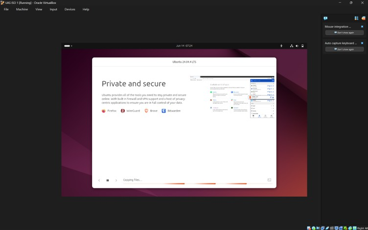
_Gambar 1.1 Proses setuap ubuntu server_

Alokasi yang digunakan:
1. Base Memory: 9815MB
2. Jumlah CPU: 8 CPU
3. Media penyimpanan: Disk berkapasitas 60GB

## 2. Instalasi
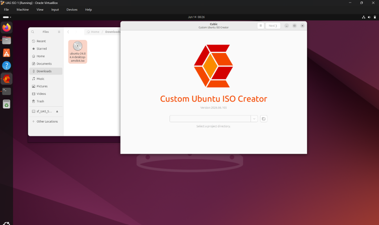
_Gambar 2.1 Instalasi CUBIC_

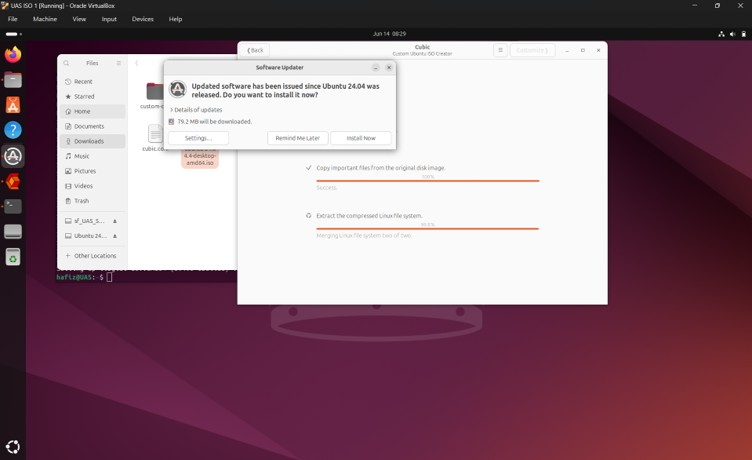
_Gambar 2.2 Memulai Proyek Remastering_

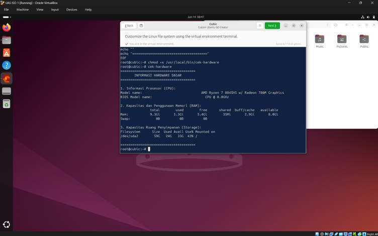
_Gambar 2.3 Aplikasi Kustom Buatan Sendiri_

Untuk menjamin kesiapan utilitas sistem, verifikasi dilakukan menggunakan skrip automasi Bash kustom bernama cek-hardware. Eksekusi skrip ini bertujuan ganda: memvalidasi kapabilitas interpreter Bash dalam memproses shell scripting, serta memverifikasi pembacaan Virtual File System (/proc). Output skrip berhasil menampilkan data prosesor, metrik RAM, dan partisi penyimpanan secara akurat, yang membuktikan kernel mampu menjembatani informasi hardware ke level user-space.

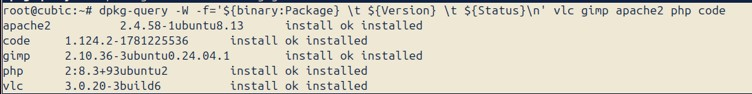
_Gambar 2.4 Verifikasi Aplikasi yang Dipasang_

Verifikasi integritas perangkat lunak dilakukan menggunakan utilitas tingkat rendah dpkg-query. Pendekatan ini dipilih karena lingkungan chroot pada Cubic memiliki keterbatasan isolasi yang sering kali menyembunyikan error pada high-level package manager seperti APT. Output menunjukkan flag install ok installed pada paket apache2 (2.4.58), code (1.124.2), gimp (2.10.36), php (8.3), dan vlc (3.0.20).

Seluruh dependensi inti telah terekstraksi dan terkonfigurasi dengan sempurna di level filesystem. Sistem dalam keadaan stabil dan siap untuk pengujian integrasi modul.

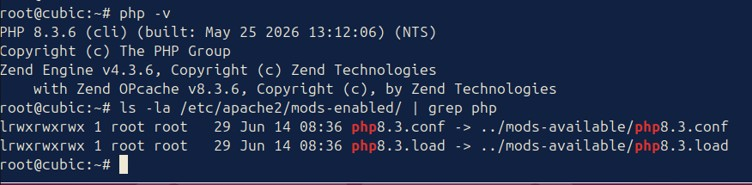
_Gambar 2.5 Verifikasi integrasi antara Apache2 dan PHP_

Langkah penting setelah instalasi tumpukan web server adalah memverifikasi integrasi antara Apache2 dan PHP. Pengujian eksekusi Command Line Interface (CLI) menunjukkan PHP versi 8.3.6 beroperasi secara normal. Lebih lanjut, inspeksi pada direktori /etc/apache2/mods-enabled/ mengonfirmasi keberadaan symbolic link untuk php8.3.conf dan php8.3.load. Hal ini memastikan bahwa modul pemroses PHP telah berstatus enabled dan siap dieksekusi oleh web server saat ISO di-booting.

## 3.Kustomisasi Tampilan 
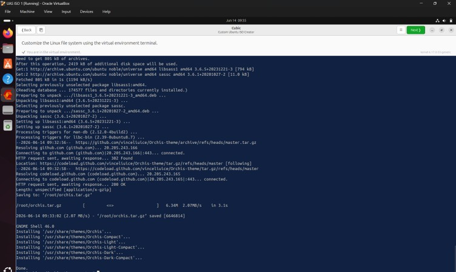
_Gambar 3.1 Instalasi Tema_

Proses instalasi dimulai dengan mengunduh dependensi kompilator CSS (sassc) dan engine render antarmuka (murrine dan pixbuf). Setelah source code Orchis Theme diunduh via wget dan diekstrak, skrip install.sh dieksekusi dengan parameter -d /usr/share/themes. Parameter ini memaksa instalasi dilakukan pada direktori sistem global. Skrip secara otomatis mendeteksi GNOME Shell versi 46.0 dan melakukan kompilasi aset theme agar kompatibel dengan lingkungan desktop tersebut.

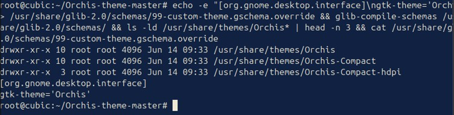
_Gambar 3.2 Memeriksa Direktori Tema Orchis_

Verifikasi dilakukan secara ganda. Pertama, inspeksi filesystem menggunakan ls -ld mengonfirmasi bahwa direktori tema Orchis telah berada di /usr/share/themes dengan hak akses 755 (drwxr-xr-x), memastikan tema dapat diakses oleh seluruh pengguna tanpa celah keamanan modifikasi. Kedua, utilitas cat memvalidasi bahwa skema GNOME telah ditimpa secara global (gtk-theme='Orchis'), sehingga antarmuka GTK akan secara otomatis merender tema ini saat GUI dimuat.

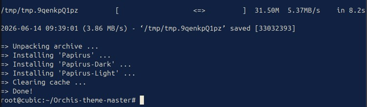
_Gambar 3.3 Instalasi Papirus_

Proses instalasi dimulai dengan memastikan paket utilitas ekstraksi (xz-utils) dan transfer data (curl) tersedia di sistem. Selanjutnya, skrip instalasi resmi Papirus diunduh dan dieksekusi secara pipeline menuju shell interpreter. Skrip ini secara otomatis mengunduh repositori ikon terbaru, mengekstraknya ke direktori global sistem, menginstal tiga varian tema (Reguler, Dark, dan Light), serta membersihkan cache instalasi untuk menjaga efisiensi ukuran build ISO.

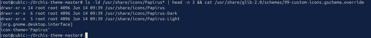
_Gambar 3.4 Mengecek Direktori Instalasi Global_

Verifikasi dilakukan dengan mengecek direktori instalasi global menggunakan ‘ls -ld’, yang membuktikan bahwa folder paket ikon Papirus telah tersedia dengan konfigurasi permission standar `755`. Selanjutnya, inspeksi pada file override skema GNOME menggunakan perintah cat mengonfirmasi bahwa parameter icon-theme telah berhasil diubah menjadi Papirus, menjamin ikon baru akan langsung dimuat secara otomatis oleh Desktop Environment.

## 4. Pembuatan File ISO

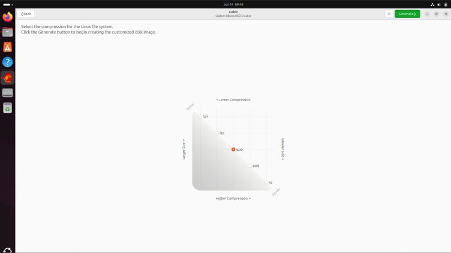
_Gambar 4.1 Pembuatan File ISO_

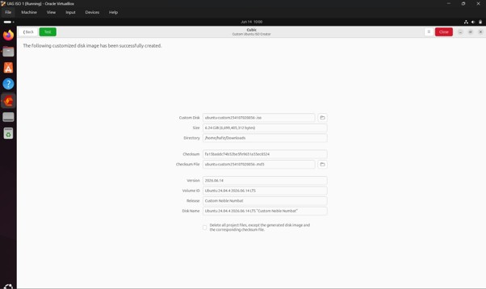
_Gambar 4.2 Proses Pembuatan File ISO_

Proses build ISO memampatkan seluruh direktori root filesystem hasil kustomisasi menggunakan mksquashfs. Sistem secara otomatis melakukan kalkulasi arsitektur, menyusun modul bootloader, dan menghasilkan file biner .iso sebesar 6.24 GiB yang tersimpan pada direktori Downloads. Proses ini juga menghasilkan file MD5 checksum untuk validasi integritas data pasca-produksi.

## 5. Dokumentasi

_Gambar 5.1 Dokumentasi Icon,Tema, dan Wallpaper_